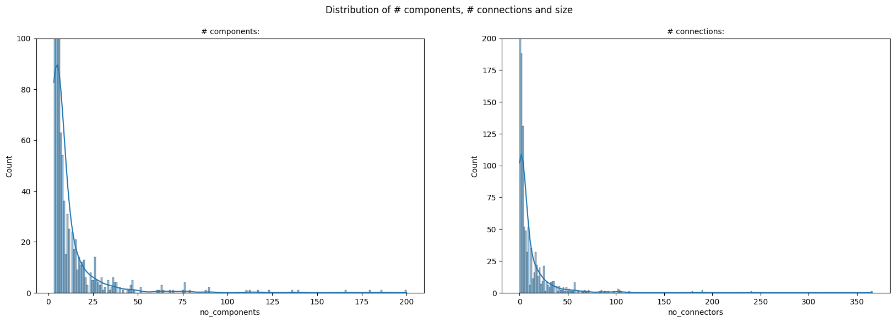
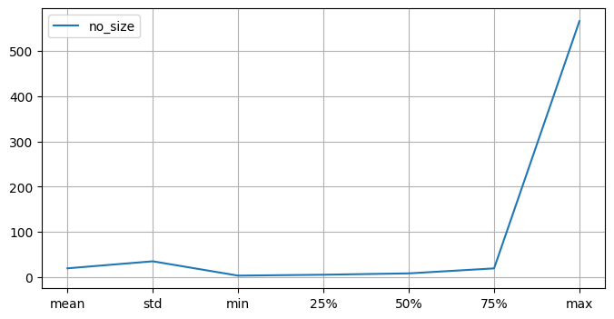
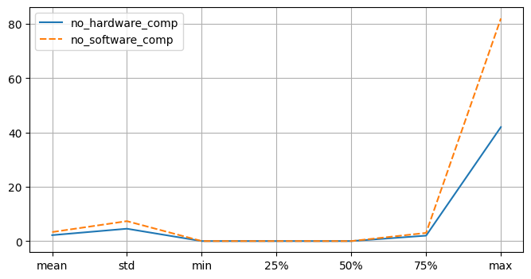
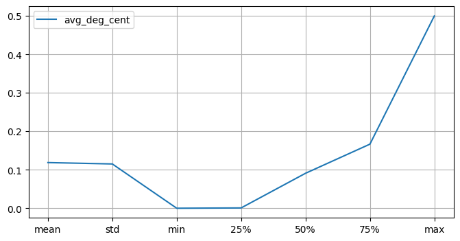
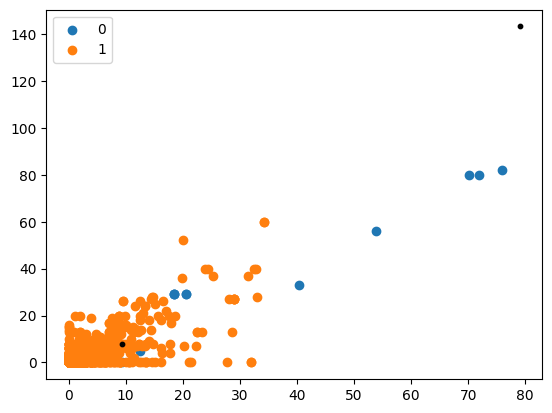

```python
pip install pandas numpy  seaborn missingno matplotlib scikit-learn joblib

```


```python

import pandas as pd
import json
import os
import missingno as ms
import seaborn as sns
import matplotlib.pyplot as plt
import sklearn as skl
```


```python
dataCsvPath = os.path.join("..","results.csv")
data_df = pd.read_csv(dataCsvPath)
src_paths = list(data_df["src_path"])

print("Number of rows:", data_df.shape[0])
print("Number of columns:", data_df.shape[1])
print("Column names:", list(data_df.columns))
```

    Number of rows: 4427
    Number of columns: 22
    Column names: ['model_name', 'src_path', 'conv_path', 'src_ext', 'is_parsed', 'is_sys_design', 'sys_name', 'no_components', 'no_connectors', 'no_hardware_comp', 'understandability', 'no_size', 'no_data_comp', 'no_software_comp', 'no_sys_comp', 'coupling', 'cohesion', 'complexity', 'graph_density', 'avg_shortest_path', 'avg_deg_cent', 'doc_files']


```python
data_df.head()
```


<div>
<style scoped>
    .dataframe tbody tr th:only-of-type {
        vertical-align: middle;
    }

    .dataframe tbody tr th {
        vertical-align: top;
    }

    .dataframe thead th {
        text-align: right;
    }
</style>
<table border="1" class="dataframe">
  <thead>
    <tr style="text-align: right;">
      <th></th>
      <th>model_name</th>
      <th>src_path</th>
      <th>conv_path</th>
      <th>src_ext</th>
      <th>is_parsed</th>
      <th>is_sys_design</th>
      <th>sys_name</th>
      <th>no_components</th>
      <th>no_connectors</th>
      <th>no_hardware_comp</th>
      <th>...</th>
      <th>no_data_comp</th>
      <th>no_software_comp</th>
      <th>no_sys_comp</th>
      <th>coupling</th>
      <th>cohesion</th>
      <th>complexity</th>
      <th>graph_density</th>
      <th>avg_shortest_path</th>
      <th>avg_deg_cent</th>
      <th>doc_files</th>
    </tr>
  </thead>
  <tbody>
    <tr>
      <th>0</th>
      <td>NaN</td>
      <td>/mnt/DATA/00-GSSI/00-WORK/EXAMPLE_ROOT_DIRECTO...</td>
      <td>/mnt/DATA/00-GSSI/00-WORK/EXAMPLE_ROOT_DIRECTO...</td>
      <td>aadl</td>
      <td>False</td>
      <td>False</td>
      <td>NaN</td>
      <td>NaN</td>
      <td>NaN</td>
      <td>NaN</td>
      <td>...</td>
      <td>NaN</td>
      <td>NaN</td>
      <td>NaN</td>
      <td>NaN</td>
      <td>NaN</td>
      <td>NaN</td>
      <td>NaN</td>
      <td>NaN</td>
      <td>NaN</td>
      <td>/mnt/DATA/00-GSSI/00-WORK/EXAMPLE_ROOT_DIRECTO...</td>
    </tr>
    <tr>
      <th>1</th>
      <td>isolette_heat_source</td>
      <td>/mnt/DATA/00-GSSI/00-WORK/EXAMPLE_ROOT_DIRECTO...</td>
      <td>/mnt/DATA/00-GSSI/00-WORK/EXAMPLE_ROOT_DIRECTO...</td>
      <td>aadl</td>
      <td>True</td>
      <td>True</td>
      <td>Heat_Source_with_devices_Instance</td>
      <td>8.0</td>
      <td>7.0</td>
      <td>4.0</td>
      <td>...</td>
      <td>0.0</td>
      <td>3.0</td>
      <td>1.0</td>
      <td>3.166667</td>
      <td>0.333333</td>
      <td>11.0</td>
      <td>1.0</td>
      <td>0.517857</td>
      <td>0.125</td>
      <td>/mnt/DATA/00-GSSI/00-WORK/EXAMPLE_ROOT_DIRECTO...</td>
    </tr>
    <tr>
      <th>2</th>
      <td>isolette_operator_interface</td>
      <td>/mnt/DATA/00-GSSI/00-WORK/EXAMPLE_ROOT_DIRECTO...</td>
      <td>NaN</td>
      <td>aadl</td>
      <td>False</td>
      <td>False</td>
      <td>NaN</td>
      <td>NaN</td>
      <td>NaN</td>
      <td>NaN</td>
      <td>...</td>
      <td>NaN</td>
      <td>NaN</td>
      <td>NaN</td>
      <td>NaN</td>
      <td>NaN</td>
      <td>NaN</td>
      <td>NaN</td>
      <td>NaN</td>
      <td>NaN</td>
      <td>/mnt/DATA/00-GSSI/00-WORK/EXAMPLE_ROOT_DIRECTO...</td>
    </tr>
    <tr>
      <th>3</th>
      <td>isolette_integration_1</td>
      <td>/mnt/DATA/00-GSSI/00-WORK/EXAMPLE_ROOT_DIRECTO...</td>
      <td>NaN</td>
      <td>aadl</td>
      <td>False</td>
      <td>False</td>
      <td>NaN</td>
      <td>NaN</td>
      <td>NaN</td>
      <td>NaN</td>
      <td>...</td>
      <td>NaN</td>
      <td>NaN</td>
      <td>NaN</td>
      <td>NaN</td>
      <td>NaN</td>
      <td>NaN</td>
      <td>NaN</td>
      <td>NaN</td>
      <td>NaN</td>
      <td>/mnt/DATA/00-GSSI/00-WORK/EXAMPLE_ROOT_DIRECTO...</td>
    </tr>
    <tr>
      <th>4</th>
      <td>isolette</td>
      <td>/mnt/DATA/00-GSSI/00-WORK/EXAMPLE_ROOT_DIRECTO...</td>
      <td>/mnt/DATA/00-GSSI/00-WORK/EXAMPLE_ROOT_DIRECTO...</td>
      <td>aadl</td>
      <td>True</td>
      <td>True</td>
      <td>Temperature_Sensor_impl_Instance</td>
      <td>2.0</td>
      <td>0.0</td>
      <td>0.0</td>
      <td>...</td>
      <td>0.0</td>
      <td>0.0</td>
      <td>2.0</td>
      <td>0.000000</td>
      <td>0.000000</td>
      <td>0.0</td>
      <td>0.0</td>
      <td>0.000000</td>
      <td>0.000</td>
      <td>/mnt/DATA/00-GSSI/00-WORK/EXAMPLE_ROOT_DIRECTO...</td>
    </tr>
  </tbody>
</table>
<p>5 rows × 22 columns</p>
</div>


## Cleaning the data, filtering the non parsed models and removing some columns


```python
data_df =data_df[(data_df["is_parsed"] == True) & (data_df["is_sys_design"] == True)]
df = data_df.loc[:, ~data_df.columns.isin(['src_path', 'conv_path',"src_ext","doc_files"])]
print("Number of rows:", data_df.shape[0])
print("Number of columns:", data_df.shape[1])
df.head()
```

    Number of rows: 3368
    Number of columns: 22


<div>
<style scoped>
    .dataframe tbody tr th:only-of-type {
        vertical-align: middle;
    }

    .dataframe tbody tr th {
        vertical-align: top;
    }

    .dataframe thead th {
        text-align: right;
    }
</style>
<table border="1" class="dataframe">
  <thead>
    <tr style="text-align: right;">
      <th></th>
      <th>model_name</th>
      <th>is_parsed</th>
      <th>is_sys_design</th>
      <th>sys_name</th>
      <th>no_components</th>
      <th>no_connectors</th>
      <th>no_hardware_comp</th>
      <th>understandability</th>
      <th>no_size</th>
      <th>no_data_comp</th>
      <th>no_software_comp</th>
      <th>no_sys_comp</th>
      <th>coupling</th>
      <th>cohesion</th>
      <th>complexity</th>
      <th>graph_density</th>
      <th>avg_shortest_path</th>
      <th>avg_deg_cent</th>
    </tr>
  </thead>
  <tbody>
    <tr>
      <th>1</th>
      <td>isolette_heat_source</td>
      <td>True</td>
      <td>True</td>
      <td>Heat_Source_with_devices_Instance</td>
      <td>8.0</td>
      <td>7.0</td>
      <td>4.0</td>
      <td>0.125</td>
      <td>15.0</td>
      <td>0.0</td>
      <td>3.0</td>
      <td>1.0</td>
      <td>3.166667</td>
      <td>0.333333</td>
      <td>11.0</td>
      <td>1.0</td>
      <td>0.517857</td>
      <td>0.125</td>
    </tr>
    <tr>
      <th>4</th>
      <td>isolette</td>
      <td>True</td>
      <td>True</td>
      <td>Temperature_Sensor_impl_Instance</td>
      <td>2.0</td>
      <td>0.0</td>
      <td>0.0</td>
      <td>0.000</td>
      <td>2.0</td>
      <td>0.0</td>
      <td>0.0</td>
      <td>2.0</td>
      <td>0.000000</td>
      <td>0.000000</td>
      <td>0.0</td>
      <td>0.0</td>
      <td>0.000000</td>
      <td>0.000</td>
    </tr>
    <tr>
      <th>8</th>
      <td>isolette_heat_source</td>
      <td>True</td>
      <td>True</td>
      <td>Heat_Source_impl_Instance</td>
      <td>6.0</td>
      <td>0.0</td>
      <td>4.0</td>
      <td>0.000</td>
      <td>6.0</td>
      <td>0.0</td>
      <td>0.0</td>
      <td>2.0</td>
      <td>1.000000</td>
      <td>0.000000</td>
      <td>2.0</td>
      <td>0.0</td>
      <td>0.000000</td>
      <td>0.000</td>
    </tr>
    <tr>
      <th>9</th>
      <td>isolette_operator_interface</td>
      <td>True</td>
      <td>True</td>
      <td>Operator_Interface_impl_Instance</td>
      <td>2.0</td>
      <td>0.0</td>
      <td>0.0</td>
      <td>0.000</td>
      <td>2.0</td>
      <td>0.0</td>
      <td>0.0</td>
      <td>2.0</td>
      <td>0.000000</td>
      <td>0.000000</td>
      <td>0.0</td>
      <td>0.0</td>
      <td>0.000000</td>
      <td>0.000</td>
    </tr>
    <tr>
      <th>13</th>
      <td>isolette_temperature_sensor</td>
      <td>True</td>
      <td>True</td>
      <td>Temperature_Sensor_impl_Instance</td>
      <td>2.0</td>
      <td>0.0</td>
      <td>0.0</td>
      <td>0.000</td>
      <td>2.0</td>
      <td>0.0</td>
      <td>0.0</td>
      <td>2.0</td>
      <td>0.000000</td>
      <td>0.000000</td>
      <td>0.0</td>
      <td>0.0</td>
      <td>0.000000</td>
      <td>0.000</td>
    </tr>
  </tbody>
</table>
</div>


## Extracting the String Data and Creating a Data Set for that


```python
text_models_data = data_df.loc[:,data_df.columns.isin(["model_name","graph_str_rep","doc_files"])]
text_models_data = text_models_data.drop_duplicates()
text_models_data.to_csv("data_text.csv",index=True)
text_models_data
```


<div>
<style scoped>
    .dataframe tbody tr th:only-of-type {
        vertical-align: middle;
    }

    .dataframe tbody tr th {
        vertical-align: top;
    }

    .dataframe thead th {
        text-align: right;
    }
</style>
<table border="1" class="dataframe">
  <thead>
    <tr style="text-align: right;">
      <th></th>
      <th>model_name</th>
      <th>doc_files</th>
    </tr>
  </thead>
  <tbody>
    <tr>
      <th>1</th>
      <td>isolette_heat_source</td>
      <td>/mnt/DATA/00-GSSI/00-WORK/EXAMPLE_ROOT_DIRECTO...</td>
    </tr>
    <tr>
      <th>4</th>
      <td>isolette</td>
      <td>/mnt/DATA/00-GSSI/00-WORK/EXAMPLE_ROOT_DIRECTO...</td>
    </tr>
    <tr>
      <th>9</th>
      <td>isolette_operator_interface</td>
      <td>/mnt/DATA/00-GSSI/00-WORK/EXAMPLE_ROOT_DIRECTO...</td>
    </tr>
    <tr>
      <th>13</th>
      <td>isolette_temperature_sensor</td>
      <td>/mnt/DATA/00-GSSI/00-WORK/EXAMPLE_ROOT_DIRECTO...</td>
    </tr>
    <tr>
      <th>17</th>
      <td>JustSubprogramGroup_process_fg</td>
      <td>/mnt/DATA/00-GSSI/00-WORK/EXAMPLE_ROOT_DIRECTO...</td>
    </tr>
    <tr>
      <th>...</th>
      <td>...</td>
      <td>...</td>
    </tr>
    <tr>
      <th>4420</th>
      <td>heterogenous_systems</td>
      <td>/mnt/DATA/00-GSSI/00-WORK/EXAMPLE_ROOT_DIRECTO...</td>
    </tr>
    <tr>
      <th>4421</th>
      <td>libmathtest</td>
      <td>/mnt/DATA/00-GSSI/00-WORK/EXAMPLE_ROOT_DIRECTO...</td>
    </tr>
    <tr>
      <th>4422</th>
      <td>model</td>
      <td>/mnt/DATA/00-GSSI/00-WORK/EXAMPLE_ROOT_DIRECTO...</td>
    </tr>
    <tr>
      <th>4423</th>
      <td>systems</td>
      <td>/mnt/DATA/00-GSSI/00-WORK/EXAMPLE_ROOT_DIRECTO...</td>
    </tr>
    <tr>
      <th>4424</th>
      <td>ardupilot_system</td>
      <td>/mnt/DATA/00-GSSI/00-WORK/EXAMPLE_ROOT_DIRECTO...</td>
    </tr>
  </tbody>
</table>
<p>1238 rows × 2 columns</p>
</div>


## Exploratory analysis


```python
df_num = df.loc[:, ~df.columns.isin(["is_parsed","is_sys_design"])]
df_num.head()
```


<div>
<style scoped>
    .dataframe tbody tr th:only-of-type {
        vertical-align: middle;
    }

    .dataframe tbody tr th {
        vertical-align: top;
    }

    .dataframe thead th {
        text-align: right;
    }
</style>
<table border="1" class="dataframe">
  <thead>
    <tr style="text-align: right;">
      <th></th>
      <th>model_name</th>
      <th>sys_name</th>
      <th>no_components</th>
      <th>no_connectors</th>
      <th>no_hardware_comp</th>
      <th>understandability</th>
      <th>no_size</th>
      <th>no_data_comp</th>
      <th>no_software_comp</th>
      <th>no_sys_comp</th>
      <th>coupling</th>
      <th>cohesion</th>
      <th>complexity</th>
      <th>graph_density</th>
      <th>avg_shortest_path</th>
      <th>avg_deg_cent</th>
    </tr>
  </thead>
  <tbody>
    <tr>
      <th>1</th>
      <td>isolette_heat_source</td>
      <td>Heat_Source_with_devices_Instance</td>
      <td>8.0</td>
      <td>7.0</td>
      <td>4.0</td>
      <td>0.125</td>
      <td>15.0</td>
      <td>0.0</td>
      <td>3.0</td>
      <td>1.0</td>
      <td>3.166667</td>
      <td>0.333333</td>
      <td>11.0</td>
      <td>1.0</td>
      <td>0.517857</td>
      <td>0.125</td>
    </tr>
    <tr>
      <th>4</th>
      <td>isolette</td>
      <td>Temperature_Sensor_impl_Instance</td>
      <td>2.0</td>
      <td>0.0</td>
      <td>0.0</td>
      <td>0.000</td>
      <td>2.0</td>
      <td>0.0</td>
      <td>0.0</td>
      <td>2.0</td>
      <td>0.000000</td>
      <td>0.000000</td>
      <td>0.0</td>
      <td>0.0</td>
      <td>0.000000</td>
      <td>0.000</td>
    </tr>
    <tr>
      <th>8</th>
      <td>isolette_heat_source</td>
      <td>Heat_Source_impl_Instance</td>
      <td>6.0</td>
      <td>0.0</td>
      <td>4.0</td>
      <td>0.000</td>
      <td>6.0</td>
      <td>0.0</td>
      <td>0.0</td>
      <td>2.0</td>
      <td>1.000000</td>
      <td>0.000000</td>
      <td>2.0</td>
      <td>0.0</td>
      <td>0.000000</td>
      <td>0.000</td>
    </tr>
    <tr>
      <th>9</th>
      <td>isolette_operator_interface</td>
      <td>Operator_Interface_impl_Instance</td>
      <td>2.0</td>
      <td>0.0</td>
      <td>0.0</td>
      <td>0.000</td>
      <td>2.0</td>
      <td>0.0</td>
      <td>0.0</td>
      <td>2.0</td>
      <td>0.000000</td>
      <td>0.000000</td>
      <td>0.0</td>
      <td>0.0</td>
      <td>0.000000</td>
      <td>0.000</td>
    </tr>
    <tr>
      <th>13</th>
      <td>isolette_temperature_sensor</td>
      <td>Temperature_Sensor_impl_Instance</td>
      <td>2.0</td>
      <td>0.0</td>
      <td>0.0</td>
      <td>0.000</td>
      <td>2.0</td>
      <td>0.0</td>
      <td>0.0</td>
      <td>2.0</td>
      <td>0.000000</td>
      <td>0.000000</td>
      <td>0.0</td>
      <td>0.0</td>
      <td>0.000000</td>
      <td>0.000</td>
    </tr>
  </tbody>
</table>
</div>


```python
df_num.isnull().sum()
```


    model_name           0
    sys_name             0
    no_components        0
    no_connectors        0
    no_hardware_comp     0
    understandability    0
    no_size              0
    no_data_comp         0
    no_software_comp     0
    no_sys_comp          0
    coupling             0
    cohesion             0
    complexity           0
    graph_density        0
    avg_shortest_path    0
    avg_deg_cent         0
    dtype: int64


### Filtering by num of componnents >= 3 


```python
df_num = df_num[(df_num["no_components"] >= 3)]
df_num
```


<div>
<style scoped>
    .dataframe tbody tr th:only-of-type {
        vertical-align: middle;
    }

    .dataframe tbody tr th {
        vertical-align: top;
    }

    .dataframe thead th {
        text-align: right;
    }
</style>
<table border="1" class="dataframe">
  <thead>
    <tr style="text-align: right;">
      <th></th>
      <th>model_name</th>
      <th>sys_name</th>
      <th>no_components</th>
      <th>no_connectors</th>
      <th>no_hardware_comp</th>
      <th>understandability</th>
      <th>no_size</th>
      <th>no_data_comp</th>
      <th>no_software_comp</th>
      <th>no_sys_comp</th>
      <th>coupling</th>
      <th>cohesion</th>
      <th>complexity</th>
      <th>graph_density</th>
      <th>avg_shortest_path</th>
      <th>avg_deg_cent</th>
    </tr>
  </thead>
  <tbody>
    <tr>
      <th>1</th>
      <td>isolette_heat_source</td>
      <td>Heat_Source_with_devices_Instance</td>
      <td>8.0</td>
      <td>7.0</td>
      <td>4.0</td>
      <td>0.125000</td>
      <td>15.0</td>
      <td>0.0</td>
      <td>3.0</td>
      <td>1.0</td>
      <td>3.166667</td>
      <td>0.333333</td>
      <td>11.0</td>
      <td>1.000000</td>
      <td>0.517857</td>
      <td>0.125000</td>
    </tr>
    <tr>
      <th>8</th>
      <td>isolette_heat_source</td>
      <td>Heat_Source_impl_Instance</td>
      <td>6.0</td>
      <td>0.0</td>
      <td>4.0</td>
      <td>0.000000</td>
      <td>6.0</td>
      <td>0.0</td>
      <td>0.0</td>
      <td>2.0</td>
      <td>1.000000</td>
      <td>0.000000</td>
      <td>2.0</td>
      <td>0.000000</td>
      <td>0.000000</td>
      <td>0.000000</td>
    </tr>
    <tr>
      <th>17</th>
      <td>JustSubprogramGroup_process_fg</td>
      <td>p1_impl_Instance</td>
      <td>4.0</td>
      <td>2.0</td>
      <td>0.0</td>
      <td>0.166667</td>
      <td>6.0</td>
      <td>0.0</td>
      <td>3.0</td>
      <td>1.0</td>
      <td>1.000000</td>
      <td>0.666667</td>
      <td>0.0</td>
      <td>0.666667</td>
      <td>0.666667</td>
      <td>0.333333</td>
    </tr>
    <tr>
      <th>18</th>
      <td>JustSubprogramGroup_process_fg</td>
      <td>Root_impl_Instance</td>
      <td>5.0</td>
      <td>2.0</td>
      <td>0.0</td>
      <td>0.100000</td>
      <td>7.0</td>
      <td>0.0</td>
      <td>3.0</td>
      <td>2.0</td>
      <td>1.000000</td>
      <td>0.333333</td>
      <td>0.0</td>
      <td>0.500000</td>
      <td>0.400000</td>
      <td>0.200000</td>
    </tr>
    <tr>
      <th>21</th>
      <td>sc3</td>
      <td>src3_i_Instance</td>
      <td>3.0</td>
      <td>1.0</td>
      <td>0.0</td>
      <td>0.166667</td>
      <td>4.0</td>
      <td>0.0</td>
      <td>0.0</td>
      <td>3.0</td>
      <td>0.000000</td>
      <td>1.000000</td>
      <td>0.0</td>
      <td>0.500000</td>
      <td>0.666667</td>
      <td>0.333333</td>
    </tr>
    <tr>
      <th>...</th>
      <td>...</td>
      <td>...</td>
      <td>...</td>
      <td>...</td>
      <td>...</td>
      <td>...</td>
      <td>...</td>
      <td>...</td>
      <td>...</td>
      <td>...</td>
      <td>...</td>
      <td>...</td>
      <td>...</td>
      <td>...</td>
      <td>...</td>
      <td>...</td>
    </tr>
    <tr>
      <th>4422</th>
      <td>model</td>
      <td>main_i_Instance</td>
      <td>36.0</td>
      <td>0.0</td>
      <td>15.0</td>
      <td>0.000000</td>
      <td>36.0</td>
      <td>0.0</td>
      <td>20.0</td>
      <td>1.0</td>
      <td>1.142857</td>
      <td>0.000000</td>
      <td>24.0</td>
      <td>0.000000</td>
      <td>0.000000</td>
      <td>0.000000</td>
    </tr>
    <tr>
      <th>4423</th>
      <td>systems</td>
      <td>mysystem_impl_Instance</td>
      <td>29.0</td>
      <td>0.0</td>
      <td>15.0</td>
      <td>0.000000</td>
      <td>29.0</td>
      <td>0.0</td>
      <td>13.0</td>
      <td>1.0</td>
      <td>1.000000</td>
      <td>0.000000</td>
      <td>8.0</td>
      <td>0.000000</td>
      <td>0.000000</td>
      <td>0.000000</td>
    </tr>
    <tr>
      <th>4424</th>
      <td>ardupilot_system</td>
      <td>ardupilot_i_Instance</td>
      <td>15.0</td>
      <td>0.0</td>
      <td>6.0</td>
      <td>0.000000</td>
      <td>15.0</td>
      <td>0.0</td>
      <td>8.0</td>
      <td>1.0</td>
      <td>0.000000</td>
      <td>0.000000</td>
      <td>0.0</td>
      <td>0.000000</td>
      <td>0.000000</td>
      <td>0.000000</td>
    </tr>
    <tr>
      <th>4425</th>
      <td>main</td>
      <td>main_i_Instance</td>
      <td>37.0</td>
      <td>0.0</td>
      <td>17.0</td>
      <td>0.000000</td>
      <td>37.0</td>
      <td>0.0</td>
      <td>19.0</td>
      <td>1.0</td>
      <td>3.933333</td>
      <td>0.000000</td>
      <td>31.0</td>
      <td>0.000000</td>
      <td>0.000000</td>
      <td>0.000000</td>
    </tr>
    <tr>
      <th>4426</th>
      <td>case_study_osal</td>
      <td>osal_i_Instance</td>
      <td>9.0</td>
      <td>0.0</td>
      <td>4.0</td>
      <td>0.000000</td>
      <td>9.0</td>
      <td>0.0</td>
      <td>4.0</td>
      <td>1.0</td>
      <td>0.000000</td>
      <td>0.000000</td>
      <td>0.0</td>
      <td>0.000000</td>
      <td>0.000000</td>
      <td>0.000000</td>
    </tr>
  </tbody>
</table>
<p>2476 rows × 16 columns</p>
</div>


### Droping duplicates with build-in


```python
df_num.drop_duplicates(inplace=True)
df_num
```


<div>
<style scoped>
    .dataframe tbody tr th:only-of-type {
        vertical-align: middle;
    }

    .dataframe tbody tr th {
        vertical-align: top;
    }

    .dataframe thead th {
        text-align: right;
    }
</style>
<table border="1" class="dataframe">
  <thead>
    <tr style="text-align: right;">
      <th></th>
      <th>model_name</th>
      <th>sys_name</th>
      <th>no_components</th>
      <th>no_connectors</th>
      <th>no_hardware_comp</th>
      <th>understandability</th>
      <th>no_size</th>
      <th>no_data_comp</th>
      <th>no_software_comp</th>
      <th>no_sys_comp</th>
      <th>coupling</th>
      <th>cohesion</th>
      <th>complexity</th>
      <th>graph_density</th>
      <th>avg_shortest_path</th>
      <th>avg_deg_cent</th>
    </tr>
  </thead>
  <tbody>
    <tr>
      <th>1</th>
      <td>isolette_heat_source</td>
      <td>Heat_Source_with_devices_Instance</td>
      <td>8.0</td>
      <td>7.0</td>
      <td>4.0</td>
      <td>0.125000</td>
      <td>15.0</td>
      <td>0.0</td>
      <td>3.0</td>
      <td>1.0</td>
      <td>3.166667</td>
      <td>0.333333</td>
      <td>11.0</td>
      <td>1.000000</td>
      <td>0.517857</td>
      <td>0.125000</td>
    </tr>
    <tr>
      <th>8</th>
      <td>isolette_heat_source</td>
      <td>Heat_Source_impl_Instance</td>
      <td>6.0</td>
      <td>0.0</td>
      <td>4.0</td>
      <td>0.000000</td>
      <td>6.0</td>
      <td>0.0</td>
      <td>0.0</td>
      <td>2.0</td>
      <td>1.000000</td>
      <td>0.000000</td>
      <td>2.0</td>
      <td>0.000000</td>
      <td>0.000000</td>
      <td>0.000000</td>
    </tr>
    <tr>
      <th>17</th>
      <td>JustSubprogramGroup_process_fg</td>
      <td>p1_impl_Instance</td>
      <td>4.0</td>
      <td>2.0</td>
      <td>0.0</td>
      <td>0.166667</td>
      <td>6.0</td>
      <td>0.0</td>
      <td>3.0</td>
      <td>1.0</td>
      <td>1.000000</td>
      <td>0.666667</td>
      <td>0.0</td>
      <td>0.666667</td>
      <td>0.666667</td>
      <td>0.333333</td>
    </tr>
    <tr>
      <th>18</th>
      <td>JustSubprogramGroup_process_fg</td>
      <td>Root_impl_Instance</td>
      <td>5.0</td>
      <td>2.0</td>
      <td>0.0</td>
      <td>0.100000</td>
      <td>7.0</td>
      <td>0.0</td>
      <td>3.0</td>
      <td>2.0</td>
      <td>1.000000</td>
      <td>0.333333</td>
      <td>0.0</td>
      <td>0.500000</td>
      <td>0.400000</td>
      <td>0.200000</td>
    </tr>
    <tr>
      <th>21</th>
      <td>sc3</td>
      <td>src3_i_Instance</td>
      <td>3.0</td>
      <td>1.0</td>
      <td>0.0</td>
      <td>0.166667</td>
      <td>4.0</td>
      <td>0.0</td>
      <td>0.0</td>
      <td>3.0</td>
      <td>0.000000</td>
      <td>1.000000</td>
      <td>0.0</td>
      <td>0.500000</td>
      <td>0.666667</td>
      <td>0.333333</td>
    </tr>
    <tr>
      <th>...</th>
      <td>...</td>
      <td>...</td>
      <td>...</td>
      <td>...</td>
      <td>...</td>
      <td>...</td>
      <td>...</td>
      <td>...</td>
      <td>...</td>
      <td>...</td>
      <td>...</td>
      <td>...</td>
      <td>...</td>
      <td>...</td>
      <td>...</td>
      <td>...</td>
    </tr>
    <tr>
      <th>4338</th>
      <td>APS</td>
      <td>COLAVandSSITAW_impl_Instance</td>
      <td>12.0</td>
      <td>6.0</td>
      <td>0.0</td>
      <td>0.045455</td>
      <td>18.0</td>
      <td>0.0</td>
      <td>11.0</td>
      <td>1.0</td>
      <td>5.000000</td>
      <td>0.109091</td>
      <td>30.0</td>
      <td>0.545455</td>
      <td>0.037879</td>
      <td>0.022727</td>
    </tr>
    <tr>
      <th>4339</th>
      <td>APS</td>
      <td>COLAVandSSITAW_Backup_impl_Instance</td>
      <td>12.0</td>
      <td>8.0</td>
      <td>0.0</td>
      <td>0.060606</td>
      <td>20.0</td>
      <td>0.0</td>
      <td>11.0</td>
      <td>1.0</td>
      <td>5.000000</td>
      <td>0.145455</td>
      <td>30.0</td>
      <td>0.727273</td>
      <td>0.030303</td>
      <td>0.030303</td>
    </tr>
    <tr>
      <th>4341</th>
      <td>APS</td>
      <td>EmergencyButtonTransmitter_impl_Instance</td>
      <td>3.0</td>
      <td>2.0</td>
      <td>1.0</td>
      <td>0.333333</td>
      <td>5.0</td>
      <td>0.0</td>
      <td>0.0</td>
      <td>2.0</td>
      <td>0.500000</td>
      <td>2.000000</td>
      <td>1.0</td>
      <td>1.000000</td>
      <td>0.666667</td>
      <td>0.333333</td>
    </tr>
    <tr>
      <th>4347</th>
      <td>Mobile5GNetwork</td>
      <td>APSCommunication_impl_Instance</td>
      <td>3.0</td>
      <td>8.0</td>
      <td>0.0</td>
      <td>1.333333</td>
      <td>11.0</td>
      <td>0.0</td>
      <td>0.0</td>
      <td>3.0</td>
      <td>1.000000</td>
      <td>8.000000</td>
      <td>8.0</td>
      <td>4.000000</td>
      <td>0.333333</td>
      <td>0.333333</td>
    </tr>
    <tr>
      <th>4360</th>
      <td>syst</td>
      <td>SecuritySystem_with_devices_Instance</td>
      <td>13.0</td>
      <td>12.0</td>
      <td>7.0</td>
      <td>0.076923</td>
      <td>25.0</td>
      <td>0.0</td>
      <td>5.0</td>
      <td>1.0</td>
      <td>6.766667</td>
      <td>0.181818</td>
      <td>16.0</td>
      <td>1.000000</td>
      <td>0.692308</td>
      <td>0.102564</td>
    </tr>
  </tbody>
</table>
<p>1334 rows × 16 columns</p>
</div>


## Visualization, metrics and statistics over the data


```python
df_data = df_num
```


```python
# Missing values
plt.title("Missing Values", fontsize=12)
ms.bar(df_data,fontsize=8,figsize=(10,3))
```


    <AxesSubplot: title={'center': 'Missing Values'}>


    

    


## Distribution for numerical metrics

### Distributions for amount of component, connection and size of every model


```python
fig, axes = plt.subplots(1, 2, figsize=(20,6))
fig.suptitle('Distribution of # components, # connections and size',fontsize=12)
axes[0].set_title('# components:',fontsize=10)
axes[1].set_title('# connections:',fontsize=10)
# axes[2].set_title('# size:',fontsize=10)
sns.histplot(ax=axes[0],data=df_data['no_components'],kde=True);
sns.histplot(ax=axes[1],data=df_data['no_connectors'],kde=True);
axes[0].set_ylim([0, 100])
axes[1].set_ylim([0, 200])
# sns.histplot(ax=axes[2],data=df_num['size'],kde=True);

```


    (0.0, 200.0)


    

    


### Description for the size parametter


```python
plt.figure(figsize=(8,4))
plt.grid()
sns.lineplot(data=df_data[["no_size"]].describe().drop("count",axis=0))
```


    <AxesSubplot: >


    

    


```python
df_data[["no_size"]].describe()
```


<div>
<style scoped>
    .dataframe tbody tr th:only-of-type {
        vertical-align: middle;
    }

    .dataframe tbody tr th {
        vertical-align: top;
    }

    .dataframe thead th {
        text-align: right;
    }
</style>
<table border="1" class="dataframe">
  <thead>
    <tr style="text-align: right;">
      <th></th>
      <th>no_size</th>
    </tr>
  </thead>
  <tbody>
    <tr>
      <th>count</th>
      <td>1334.000000</td>
    </tr>
    <tr>
      <th>mean</th>
      <td>19.159670</td>
    </tr>
    <tr>
      <th>std</th>
      <td>34.716892</td>
    </tr>
    <tr>
      <th>min</th>
      <td>3.000000</td>
    </tr>
    <tr>
      <th>25%</th>
      <td>5.000000</td>
    </tr>
    <tr>
      <th>50%</th>
      <td>8.000000</td>
    </tr>
    <tr>
      <th>75%</th>
      <td>19.000000</td>
    </tr>
    <tr>
      <th>max</th>
      <td>566.000000</td>
    </tr>
  </tbody>
</table>
</div>


```python
small_size = df_data[(df_num["no_size"] >= 1) & (df_data["no_size"] <= 13) ]
(x,_) = small_size.shape
print("percent: ", ((x) / df_data.shape[0])*100)
small_size
```

    percent:  67.31634182908546


<div>
<style scoped>
    .dataframe tbody tr th:only-of-type {
        vertical-align: middle;
    }

    .dataframe tbody tr th {
        vertical-align: top;
    }

    .dataframe thead th {
        text-align: right;
    }
</style>
<table border="1" class="dataframe">
  <thead>
    <tr style="text-align: right;">
      <th></th>
      <th>model_name</th>
      <th>sys_name</th>
      <th>no_components</th>
      <th>no_connectors</th>
      <th>no_hardware_comp</th>
      <th>understandability</th>
      <th>no_size</th>
      <th>no_data_comp</th>
      <th>no_software_comp</th>
      <th>no_sys_comp</th>
      <th>coupling</th>
      <th>cohesion</th>
      <th>complexity</th>
      <th>graph_density</th>
      <th>avg_shortest_path</th>
      <th>avg_deg_cent</th>
    </tr>
  </thead>
  <tbody>
    <tr>
      <th>8</th>
      <td>isolette_heat_source</td>
      <td>Heat_Source_impl_Instance</td>
      <td>6.0</td>
      <td>0.0</td>
      <td>4.0</td>
      <td>0.000000</td>
      <td>6.0</td>
      <td>0.0</td>
      <td>0.0</td>
      <td>2.0</td>
      <td>1.0</td>
      <td>0.000000</td>
      <td>2.0</td>
      <td>0.000000</td>
      <td>0.000000</td>
      <td>0.000000</td>
    </tr>
    <tr>
      <th>17</th>
      <td>JustSubprogramGroup_process_fg</td>
      <td>p1_impl_Instance</td>
      <td>4.0</td>
      <td>2.0</td>
      <td>0.0</td>
      <td>0.166667</td>
      <td>6.0</td>
      <td>0.0</td>
      <td>3.0</td>
      <td>1.0</td>
      <td>1.0</td>
      <td>0.666667</td>
      <td>0.0</td>
      <td>0.666667</td>
      <td>0.666667</td>
      <td>0.333333</td>
    </tr>
    <tr>
      <th>18</th>
      <td>JustSubprogramGroup_process_fg</td>
      <td>Root_impl_Instance</td>
      <td>5.0</td>
      <td>2.0</td>
      <td>0.0</td>
      <td>0.100000</td>
      <td>7.0</td>
      <td>0.0</td>
      <td>3.0</td>
      <td>2.0</td>
      <td>1.0</td>
      <td>0.333333</td>
      <td>0.0</td>
      <td>0.500000</td>
      <td>0.400000</td>
      <td>0.200000</td>
    </tr>
    <tr>
      <th>21</th>
      <td>sc3</td>
      <td>src3_i_Instance</td>
      <td>3.0</td>
      <td>1.0</td>
      <td>0.0</td>
      <td>0.166667</td>
      <td>4.0</td>
      <td>0.0</td>
      <td>0.0</td>
      <td>3.0</td>
      <td>0.0</td>
      <td>1.000000</td>
      <td>0.0</td>
      <td>0.500000</td>
      <td>0.666667</td>
      <td>0.333333</td>
    </tr>
    <tr>
      <th>24</th>
      <td>sc3</td>
      <td>whole_i_Instance</td>
      <td>6.0</td>
      <td>1.0</td>
      <td>0.0</td>
      <td>0.033333</td>
      <td>7.0</td>
      <td>0.0</td>
      <td>0.0</td>
      <td>6.0</td>
      <td>2.0</td>
      <td>0.100000</td>
      <td>0.0</td>
      <td>0.200000</td>
      <td>0.666667</td>
      <td>0.133333</td>
    </tr>
    <tr>
      <th>...</th>
      <td>...</td>
      <td>...</td>
      <td>...</td>
      <td>...</td>
      <td>...</td>
      <td>...</td>
      <td>...</td>
      <td>...</td>
      <td>...</td>
      <td>...</td>
      <td>...</td>
      <td>...</td>
      <td>...</td>
      <td>...</td>
      <td>...</td>
      <td>...</td>
    </tr>
    <tr>
      <th>4334</th>
      <td>APS</td>
      <td>GNSS_IMU_Main_impl_Instance</td>
      <td>3.0</td>
      <td>0.0</td>
      <td>0.0</td>
      <td>0.000000</td>
      <td>3.0</td>
      <td>0.0</td>
      <td>2.0</td>
      <td>1.0</td>
      <td>1.0</td>
      <td>0.000000</td>
      <td>2.0</td>
      <td>0.000000</td>
      <td>0.000000</td>
      <td>0.000000</td>
    </tr>
    <tr>
      <th>4335</th>
      <td>APS</td>
      <td>GNSS_IMU_Backup_impl_Instance</td>
      <td>3.0</td>
      <td>0.0</td>
      <td>0.0</td>
      <td>0.000000</td>
      <td>3.0</td>
      <td>0.0</td>
      <td>2.0</td>
      <td>1.0</td>
      <td>1.0</td>
      <td>0.000000</td>
      <td>2.0</td>
      <td>0.000000</td>
      <td>0.000000</td>
      <td>0.000000</td>
    </tr>
    <tr>
      <th>4337</th>
      <td>APS</td>
      <td>IS3MS_impl_Instance</td>
      <td>3.0</td>
      <td>6.0</td>
      <td>0.0</td>
      <td>1.000000</td>
      <td>9.0</td>
      <td>0.0</td>
      <td>2.0</td>
      <td>1.0</td>
      <td>1.0</td>
      <td>6.000000</td>
      <td>10.0</td>
      <td>3.000000</td>
      <td>0.833333</td>
      <td>0.500000</td>
    </tr>
    <tr>
      <th>4341</th>
      <td>APS</td>
      <td>EmergencyButtonTransmitter_impl_Instance</td>
      <td>3.0</td>
      <td>2.0</td>
      <td>1.0</td>
      <td>0.333333</td>
      <td>5.0</td>
      <td>0.0</td>
      <td>0.0</td>
      <td>2.0</td>
      <td>0.5</td>
      <td>2.000000</td>
      <td>1.0</td>
      <td>1.000000</td>
      <td>0.666667</td>
      <td>0.333333</td>
    </tr>
    <tr>
      <th>4347</th>
      <td>Mobile5GNetwork</td>
      <td>APSCommunication_impl_Instance</td>
      <td>3.0</td>
      <td>8.0</td>
      <td>0.0</td>
      <td>1.333333</td>
      <td>11.0</td>
      <td>0.0</td>
      <td>0.0</td>
      <td>3.0</td>
      <td>1.0</td>
      <td>8.000000</td>
      <td>8.0</td>
      <td>4.000000</td>
      <td>0.333333</td>
      <td>0.333333</td>
    </tr>
  </tbody>
</table>
<p>898 rows × 16 columns</p>
</div>


### Distributions for amount of category of the components


```python
fig, axes = plt.subplots(1, 2, figsize=(20,5))
fig.suptitle('Distribution of # category types: ["no_hardware_comp","no_software_comp"]',fontsize=12)
axes[0].set_title('# no_hardware_comp:',fontsize=10)
axes[1].set_title('# no_software_comp:',fontsize=10)
sns.histplot(ax=axes[0],data=df_data['no_hardware_comp'],kde=True,color='orange');
sns.histplot(ax=axes[1],data=df_data['no_software_comp'],kde=True,color='orange');
axes[0].set_ylim([0, 100])
axes[1].set_ylim([0, 200])
```


    (0.0, 200.0)


    

    


### Description for no_hardware_comp and no_software_comp


```python
df_data[["no_hardware_comp"]].describe()
```


<div>
<style scoped>
    .dataframe tbody tr th:only-of-type {
        vertical-align: middle;
    }

    .dataframe tbody tr th {
        vertical-align: top;
    }

    .dataframe thead th {
        text-align: right;
    }
</style>
<table border="1" class="dataframe">
  <thead>
    <tr style="text-align: right;">
      <th></th>
      <th>no_hardware_comp</th>
    </tr>
  </thead>
  <tbody>
    <tr>
      <th>count</th>
      <td>1334.000000</td>
    </tr>
    <tr>
      <th>mean</th>
      <td>2.182909</td>
    </tr>
    <tr>
      <th>std</th>
      <td>4.550572</td>
    </tr>
    <tr>
      <th>min</th>
      <td>0.000000</td>
    </tr>
    <tr>
      <th>25%</th>
      <td>0.000000</td>
    </tr>
    <tr>
      <th>50%</th>
      <td>0.000000</td>
    </tr>
    <tr>
      <th>75%</th>
      <td>2.000000</td>
    </tr>
    <tr>
      <th>max</th>
      <td>42.000000</td>
    </tr>
  </tbody>
</table>
</div>


```python
df_data[["no_software_comp"]].describe()
```


<div>
<style scoped>
    .dataframe tbody tr th:only-of-type {
        vertical-align: middle;
    }

    .dataframe tbody tr th {
        vertical-align: top;
    }

    .dataframe thead th {
        text-align: right;
    }
</style>
<table border="1" class="dataframe">
  <thead>
    <tr style="text-align: right;">
      <th></th>
      <th>no_software_comp</th>
    </tr>
  </thead>
  <tbody>
    <tr>
      <th>count</th>
      <td>1334.000000</td>
    </tr>
    <tr>
      <th>mean</th>
      <td>3.320840</td>
    </tr>
    <tr>
      <th>std</th>
      <td>7.339617</td>
    </tr>
    <tr>
      <th>min</th>
      <td>0.000000</td>
    </tr>
    <tr>
      <th>25%</th>
      <td>0.000000</td>
    </tr>
    <tr>
      <th>50%</th>
      <td>0.000000</td>
    </tr>
    <tr>
      <th>75%</th>
      <td>3.000000</td>
    </tr>
    <tr>
      <th>max</th>
      <td>82.000000</td>
    </tr>
  </tbody>
</table>
</div>


```python
df_data[df_data["no_software_comp"]>= 5]
```


<div>
<style scoped>
    .dataframe tbody tr th:only-of-type {
        vertical-align: middle;
    }

    .dataframe tbody tr th {
        vertical-align: top;
    }

    .dataframe thead th {
        text-align: right;
    }
</style>
<table border="1" class="dataframe">
  <thead>
    <tr style="text-align: right;">
      <th></th>
      <th>model_name</th>
      <th>sys_name</th>
      <th>no_components</th>
      <th>no_connectors</th>
      <th>no_hardware_comp</th>
      <th>understandability</th>
      <th>no_size</th>
      <th>no_data_comp</th>
      <th>no_software_comp</th>
      <th>no_sys_comp</th>
      <th>coupling</th>
      <th>cohesion</th>
      <th>complexity</th>
      <th>graph_density</th>
      <th>avg_shortest_path</th>
      <th>avg_deg_cent</th>
    </tr>
  </thead>
  <tbody>
    <tr>
      <th>82</th>
      <td>SimpleControlSystem</td>
      <td>SCS_tier2_Instance</td>
      <td>16.0</td>
      <td>10.0</td>
      <td>6.0</td>
      <td>0.041667</td>
      <td>26.0</td>
      <td>0.0</td>
      <td>6.0</td>
      <td>4.0</td>
      <td>10.100000</td>
      <td>0.095238</td>
      <td>22.0</td>
      <td>0.666667</td>
      <td>1.545833</td>
      <td>0.087500</td>
    </tr>
    <tr>
      <th>83</th>
      <td>SimpleControlSystem</td>
      <td>SCS_dualtier2_Instance</td>
      <td>17.0</td>
      <td>11.0</td>
      <td>7.0</td>
      <td>0.040441</td>
      <td>28.0</td>
      <td>0.0</td>
      <td>6.0</td>
      <td>4.0</td>
      <td>11.100000</td>
      <td>0.091667</td>
      <td>22.0</td>
      <td>0.687500</td>
      <td>1.363971</td>
      <td>0.077206</td>
    </tr>
    <tr>
      <th>251</th>
      <td>issue2056</td>
      <td>Example_impl_Instance</td>
      <td>8.0</td>
      <td>2.0</td>
      <td>1.0</td>
      <td>0.035714</td>
      <td>10.0</td>
      <td>0.0</td>
      <td>6.0</td>
      <td>1.0</td>
      <td>2.000000</td>
      <td>0.095238</td>
      <td>4.0</td>
      <td>0.285714</td>
      <td>0.357143</td>
      <td>0.107143</td>
    </tr>
    <tr>
      <th>281</th>
      <td>integration::main</td>
      <td>main_impl_Instance</td>
      <td>47.0</td>
      <td>53.0</td>
      <td>4.0</td>
      <td>0.024514</td>
      <td>100.0</td>
      <td>0.0</td>
      <td>8.0</td>
      <td>35.0</td>
      <td>14.788095</td>
      <td>0.051208</td>
      <td>235.0</td>
      <td>1.152174</td>
      <td>0.388067</td>
      <td>0.024977</td>
    </tr>
    <tr>
      <th>294</th>
      <td>DigitalControlSystem</td>
      <td>DCS_singletier2_Instance</td>
      <td>12.0</td>
      <td>11.0</td>
      <td>3.0</td>
      <td>0.083333</td>
      <td>23.0</td>
      <td>0.0</td>
      <td>6.0</td>
      <td>3.0</td>
      <td>7.166667</td>
      <td>0.200000</td>
      <td>12.0</td>
      <td>1.000000</td>
      <td>0.939394</td>
      <td>0.136364</td>
    </tr>
    <tr>
      <th>...</th>
      <td>...</td>
      <td>...</td>
      <td>...</td>
      <td>...</td>
      <td>...</td>
      <td>...</td>
      <td>...</td>
      <td>...</td>
      <td>...</td>
      <td>...</td>
      <td>...</td>
      <td>...</td>
      <td>...</td>
      <td>...</td>
      <td>...</td>
      <td>...</td>
    </tr>
    <tr>
      <th>4320</th>
      <td>APS</td>
      <td>ASC_Backup_impl_Instance</td>
      <td>30.0</td>
      <td>26.0</td>
      <td>0.0</td>
      <td>0.029885</td>
      <td>56.0</td>
      <td>0.0</td>
      <td>26.0</td>
      <td>4.0</td>
      <td>9.500000</td>
      <td>0.064039</td>
      <td>69.0</td>
      <td>0.896552</td>
      <td>0.079310</td>
      <td>0.024138</td>
    </tr>
    <tr>
      <th>4336</th>
      <td>APS</td>
      <td>NetworkAndSystemManagement_impl_Instance</td>
      <td>14.0</td>
      <td>12.0</td>
      <td>0.0</td>
      <td>0.065934</td>
      <td>26.0</td>
      <td>0.0</td>
      <td>13.0</td>
      <td>1.0</td>
      <td>2.000000</td>
      <td>0.153846</td>
      <td>12.0</td>
      <td>0.923077</td>
      <td>0.137363</td>
      <td>0.038462</td>
    </tr>
    <tr>
      <th>4338</th>
      <td>APS</td>
      <td>COLAVandSSITAW_impl_Instance</td>
      <td>12.0</td>
      <td>6.0</td>
      <td>0.0</td>
      <td>0.045455</td>
      <td>18.0</td>
      <td>0.0</td>
      <td>11.0</td>
      <td>1.0</td>
      <td>5.000000</td>
      <td>0.109091</td>
      <td>30.0</td>
      <td>0.545455</td>
      <td>0.037879</td>
      <td>0.022727</td>
    </tr>
    <tr>
      <th>4339</th>
      <td>APS</td>
      <td>COLAVandSSITAW_Backup_impl_Instance</td>
      <td>12.0</td>
      <td>8.0</td>
      <td>0.0</td>
      <td>0.060606</td>
      <td>20.0</td>
      <td>0.0</td>
      <td>11.0</td>
      <td>1.0</td>
      <td>5.000000</td>
      <td>0.145455</td>
      <td>30.0</td>
      <td>0.727273</td>
      <td>0.030303</td>
      <td>0.030303</td>
    </tr>
    <tr>
      <th>4360</th>
      <td>syst</td>
      <td>SecuritySystem_with_devices_Instance</td>
      <td>13.0</td>
      <td>12.0</td>
      <td>7.0</td>
      <td>0.076923</td>
      <td>25.0</td>
      <td>0.0</td>
      <td>5.0</td>
      <td>1.0</td>
      <td>6.766667</td>
      <td>0.181818</td>
      <td>16.0</td>
      <td>1.000000</td>
      <td>0.692308</td>
      <td>0.102564</td>
    </tr>
  </tbody>
</table>
<p>255 rows × 16 columns</p>
</div>


```python
df_data[df_data["no_hardware_comp"] >= 5]
```


<div>
<style scoped>
    .dataframe tbody tr th:only-of-type {
        vertical-align: middle;
    }

    .dataframe tbody tr th {
        vertical-align: top;
    }

    .dataframe thead th {
        text-align: right;
    }
</style>
<table border="1" class="dataframe">
  <thead>
    <tr style="text-align: right;">
      <th></th>
      <th>model_name</th>
      <th>sys_name</th>
      <th>no_components</th>
      <th>no_connectors</th>
      <th>no_hardware_comp</th>
      <th>understandability</th>
      <th>no_size</th>
      <th>no_data_comp</th>
      <th>no_software_comp</th>
      <th>no_sys_comp</th>
      <th>coupling</th>
      <th>cohesion</th>
      <th>complexity</th>
      <th>graph_density</th>
      <th>avg_shortest_path</th>
      <th>avg_deg_cent</th>
    </tr>
  </thead>
  <tbody>
    <tr>
      <th>81</th>
      <td>SimpleControlSystem</td>
      <td>SCS_tier1_Instance</td>
      <td>12.0</td>
      <td>9.0</td>
      <td>6.0</td>
      <td>0.068182</td>
      <td>21.0</td>
      <td>0.0</td>
      <td>2.0</td>
      <td>4.0</td>
      <td>8.100000</td>
      <td>0.163636</td>
      <td>18.0</td>
      <td>0.818182</td>
      <td>0.901515</td>
      <td>0.106061</td>
    </tr>
    <tr>
      <th>82</th>
      <td>SimpleControlSystem</td>
      <td>SCS_tier2_Instance</td>
      <td>16.0</td>
      <td>10.0</td>
      <td>6.0</td>
      <td>0.041667</td>
      <td>26.0</td>
      <td>0.0</td>
      <td>6.0</td>
      <td>4.0</td>
      <td>10.100000</td>
      <td>0.095238</td>
      <td>22.0</td>
      <td>0.666667</td>
      <td>1.545833</td>
      <td>0.087500</td>
    </tr>
    <tr>
      <th>83</th>
      <td>SimpleControlSystem</td>
      <td>SCS_dualtier2_Instance</td>
      <td>17.0</td>
      <td>11.0</td>
      <td>7.0</td>
      <td>0.040441</td>
      <td>28.0</td>
      <td>0.0</td>
      <td>6.0</td>
      <td>4.0</td>
      <td>11.100000</td>
      <td>0.091667</td>
      <td>22.0</td>
      <td>0.687500</td>
      <td>1.363971</td>
      <td>0.077206</td>
    </tr>
    <tr>
      <th>106</th>
      <td>AircraftSafetyExample::AOADiscrepancy</td>
      <td>ac_OneSensorSpec_Instance</td>
      <td>9.0</td>
      <td>10.0</td>
      <td>6.0</td>
      <td>0.138889</td>
      <td>19.0</td>
      <td>0.0</td>
      <td>0.0</td>
      <td>1.0</td>
      <td>2.433333</td>
      <td>0.357143</td>
      <td>14.0</td>
      <td>1.250000</td>
      <td>0.555556</td>
      <td>0.138889</td>
    </tr>
    <tr>
      <th>107</th>
      <td>AircraftSafetyExample::AOADiscrepancy</td>
      <td>ac_OSSPermanentDiscrepancyFail_Instance</td>
      <td>9.0</td>
      <td>10.0</td>
      <td>6.0</td>
      <td>0.138889</td>
      <td>19.0</td>
      <td>0.0</td>
      <td>0.0</td>
      <td>1.0</td>
      <td>2.433333</td>
      <td>0.357143</td>
      <td>14.0</td>
      <td>1.250000</td>
      <td>0.555556</td>
      <td>0.138889</td>
    </tr>
    <tr>
      <th>...</th>
      <td>...</td>
      <td>...</td>
      <td>...</td>
      <td>...</td>
      <td>...</td>
      <td>...</td>
      <td>...</td>
      <td>...</td>
      <td>...</td>
      <td>...</td>
      <td>...</td>
      <td>...</td>
      <td>...</td>
      <td>...</td>
      <td>...</td>
      <td>...</td>
    </tr>
    <tr>
      <th>4329</th>
      <td>APS</td>
      <td>NavigationSystem_impl_Instance</td>
      <td>26.0</td>
      <td>52.0</td>
      <td>21.0</td>
      <td>0.080000</td>
      <td>78.0</td>
      <td>0.0</td>
      <td>0.0</td>
      <td>5.0</td>
      <td>12.666667</td>
      <td>0.173333</td>
      <td>318.0</td>
      <td>2.080000</td>
      <td>2.283077</td>
      <td>0.070769</td>
    </tr>
    <tr>
      <th>4330</th>
      <td>APS</td>
      <td>NavigationSystem_impl_withRedundancy_Instance</td>
      <td>27.0</td>
      <td>54.0</td>
      <td>21.0</td>
      <td>0.076923</td>
      <td>81.0</td>
      <td>0.0</td>
      <td>0.0</td>
      <td>6.0</td>
      <td>13.166667</td>
      <td>0.166154</td>
      <td>382.0</td>
      <td>2.076923</td>
      <td>1.072650</td>
      <td>0.066952</td>
    </tr>
    <tr>
      <th>4331</th>
      <td>APS</td>
      <td>NavigationSystem_impl_withRedundancy2_Instance</td>
      <td>33.0</td>
      <td>58.0</td>
      <td>21.0</td>
      <td>0.054924</td>
      <td>91.0</td>
      <td>0.0</td>
      <td>4.0</td>
      <td>8.0</td>
      <td>16.333333</td>
      <td>0.116935</td>
      <td>395.0</td>
      <td>1.812500</td>
      <td>0.953598</td>
      <td>0.044508</td>
    </tr>
    <tr>
      <th>4333</th>
      <td>APS</td>
      <td>NavigationSystem_Backup_impl_withRedundancy_In...</td>
      <td>13.0</td>
      <td>16.0</td>
      <td>8.0</td>
      <td>0.102564</td>
      <td>29.0</td>
      <td>0.0</td>
      <td>0.0</td>
      <td>5.0</td>
      <td>6.166667</td>
      <td>0.242424</td>
      <td>170.0</td>
      <td>1.333333</td>
      <td>0.282051</td>
      <td>0.076923</td>
    </tr>
    <tr>
      <th>4360</th>
      <td>syst</td>
      <td>SecuritySystem_with_devices_Instance</td>
      <td>13.0</td>
      <td>12.0</td>
      <td>7.0</td>
      <td>0.076923</td>
      <td>25.0</td>
      <td>0.0</td>
      <td>5.0</td>
      <td>1.0</td>
      <td>6.766667</td>
      <td>0.181818</td>
      <td>16.0</td>
      <td>1.000000</td>
      <td>0.692308</td>
      <td>0.102564</td>
    </tr>
  </tbody>
</table>
<p>213 rows × 16 columns</p>
</div>


```python
df_data[["no_data_comp"]].describe()
```


<div>
<style scoped>
    .dataframe tbody tr th:only-of-type {
        vertical-align: middle;
    }

    .dataframe tbody tr th {
        vertical-align: top;
    }

    .dataframe thead th {
        text-align: right;
    }
</style>
<table border="1" class="dataframe">
  <thead>
    <tr style="text-align: right;">
      <th></th>
      <th>no_data_comp</th>
    </tr>
  </thead>
  <tbody>
    <tr>
      <th>count</th>
      <td>1334.000000</td>
    </tr>
    <tr>
      <th>mean</th>
      <td>1.184408</td>
    </tr>
    <tr>
      <th>std</th>
      <td>9.354430</td>
    </tr>
    <tr>
      <th>min</th>
      <td>0.000000</td>
    </tr>
    <tr>
      <th>25%</th>
      <td>0.000000</td>
    </tr>
    <tr>
      <th>50%</th>
      <td>0.000000</td>
    </tr>
    <tr>
      <th>75%</th>
      <td>0.000000</td>
    </tr>
    <tr>
      <th>max</th>
      <td>170.000000</td>
    </tr>
  </tbody>
</table>
</div>


```python
df_data[df_data["no_data_comp"] >= 5].head(10)
```


<div>
<style scoped>
    .dataframe tbody tr th:only-of-type {
        vertical-align: middle;
    }

    .dataframe tbody tr th {
        vertical-align: top;
    }

    .dataframe thead th {
        text-align: right;
    }
</style>
<table border="1" class="dataframe">
  <thead>
    <tr style="text-align: right;">
      <th></th>
      <th>model_name</th>
      <th>sys_name</th>
      <th>no_components</th>
      <th>no_connectors</th>
      <th>no_hardware_comp</th>
      <th>understandability</th>
      <th>no_size</th>
      <th>no_data_comp</th>
      <th>no_software_comp</th>
      <th>no_sys_comp</th>
      <th>coupling</th>
      <th>cohesion</th>
      <th>complexity</th>
      <th>graph_density</th>
      <th>avg_shortest_path</th>
      <th>avg_deg_cent</th>
    </tr>
  </thead>
  <tbody>
    <tr>
      <th>30</th>
      <td>data_port_to_data</td>
      <td>top_impl_Instance</td>
      <td>11.0</td>
      <td>16.0</td>
      <td>0.0</td>
      <td>0.145455</td>
      <td>27.0</td>
      <td>8.0</td>
      <td>2.0</td>
      <td>1.0</td>
      <td>0.500000</td>
      <td>0.355556</td>
      <td>1.0</td>
      <td>1.600000</td>
      <td>1.163636</td>
      <td>0.145455</td>
    </tr>
    <tr>
      <th>231</th>
      <td>CasePositionControl</td>
      <td>SMS_buffered_Instance</td>
      <td>12.0</td>
      <td>13.0</td>
      <td>2.0</td>
      <td>0.098485</td>
      <td>25.0</td>
      <td>6.0</td>
      <td>3.0</td>
      <td>1.0</td>
      <td>2.238095</td>
      <td>0.236364</td>
      <td>22.0</td>
      <td>1.181818</td>
      <td>0.143939</td>
      <td>0.053030</td>
    </tr>
    <tr>
      <th>234</th>
      <td>CasePositionControl</td>
      <td>SMS_Operational_Environment_buffered_Instance</td>
      <td>19.0</td>
      <td>21.0</td>
      <td>6.0</td>
      <td>0.061404</td>
      <td>40.0</td>
      <td>6.0</td>
      <td>3.0</td>
      <td>4.0</td>
      <td>5.654762</td>
      <td>0.137255</td>
      <td>29.0</td>
      <td>1.166667</td>
      <td>0.836257</td>
      <td>0.064327</td>
    </tr>
    <tr>
      <th>463</th>
      <td>access_to_data</td>
      <td>top_impl_Instance</td>
      <td>11.0</td>
      <td>16.0</td>
      <td>0.0</td>
      <td>0.145455</td>
      <td>27.0</td>
      <td>8.0</td>
      <td>2.0</td>
      <td>1.0</td>
      <td>1.000000</td>
      <td>0.355556</td>
      <td>0.0</td>
      <td>1.600000</td>
      <td>1.163636</td>
      <td>0.145455</td>
    </tr>
    <tr>
      <th>611</th>
      <td>DeclarativeTests</td>
      <td>Sub_to_provides_comp_outgoing_Instance</td>
      <td>6.0</td>
      <td>9.0</td>
      <td>0.0</td>
      <td>0.300000</td>
      <td>15.0</td>
      <td>5.0</td>
      <td>0.0</td>
      <td>1.0</td>
      <td>0.000000</td>
      <td>0.900000</td>
      <td>0.0</td>
      <td>1.800000</td>
      <td>0.166667</td>
      <td>0.166667</td>
    </tr>
    <tr>
      <th>612</th>
      <td>DeclarativeTests</td>
      <td>Sub_to_provides_comp_incoming_Instance</td>
      <td>6.0</td>
      <td>9.0</td>
      <td>0.0</td>
      <td>0.300000</td>
      <td>15.0</td>
      <td>5.0</td>
      <td>0.0</td>
      <td>1.0</td>
      <td>0.000000</td>
      <td>0.900000</td>
      <td>0.0</td>
      <td>1.800000</td>
      <td>0.000000</td>
      <td>0.000000</td>
    </tr>
    <tr>
      <th>613</th>
      <td>DeclarativeTests</td>
      <td>Sub_to_provides_comp_bidir_Instance</td>
      <td>6.0</td>
      <td>18.0</td>
      <td>0.0</td>
      <td>0.600000</td>
      <td>24.0</td>
      <td>5.0</td>
      <td>0.0</td>
      <td>1.0</td>
      <td>0.000000</td>
      <td>1.800000</td>
      <td>0.0</td>
      <td>3.600000</td>
      <td>0.166667</td>
      <td>0.166667</td>
    </tr>
    <tr>
      <th>614</th>
      <td>DeclarativeTests</td>
      <td>Sub_to_provides_comp_bidir2_Instance</td>
      <td>6.0</td>
      <td>18.0</td>
      <td>0.0</td>
      <td>0.600000</td>
      <td>24.0</td>
      <td>5.0</td>
      <td>0.0</td>
      <td>1.0</td>
      <td>0.000000</td>
      <td>1.800000</td>
      <td>0.0</td>
      <td>3.600000</td>
      <td>0.166667</td>
      <td>0.166667</td>
    </tr>
    <tr>
      <th>615</th>
      <td>DeclarativeTests</td>
      <td>Sub_FG_to_provides_comp_outgoing_Instance</td>
      <td>6.0</td>
      <td>9.0</td>
      <td>0.0</td>
      <td>0.300000</td>
      <td>15.0</td>
      <td>5.0</td>
      <td>0.0</td>
      <td>1.0</td>
      <td>0.000000</td>
      <td>0.900000</td>
      <td>0.0</td>
      <td>1.800000</td>
      <td>0.166667</td>
      <td>0.166667</td>
    </tr>
    <tr>
      <th>616</th>
      <td>DeclarativeTests</td>
      <td>Sub_FG_to_provides_comp_incoming_Instance</td>
      <td>6.0</td>
      <td>9.0</td>
      <td>0.0</td>
      <td>0.300000</td>
      <td>15.0</td>
      <td>5.0</td>
      <td>0.0</td>
      <td>1.0</td>
      <td>0.000000</td>
      <td>0.900000</td>
      <td>0.0</td>
      <td>1.800000</td>
      <td>0.000000</td>
      <td>0.000000</td>
    </tr>
  </tbody>
</table>
</div>


```python
df_data[df_data["no_sys_comp"] >= 5]
```


<div>
<style scoped>
    .dataframe tbody tr th:only-of-type {
        vertical-align: middle;
    }

    .dataframe tbody tr th {
        vertical-align: top;
    }

    .dataframe thead th {
        text-align: right;
    }
</style>
<table border="1" class="dataframe">
  <thead>
    <tr style="text-align: right;">
      <th></th>
      <th>model_name</th>
      <th>sys_name</th>
      <th>no_components</th>
      <th>no_connectors</th>
      <th>no_hardware_comp</th>
      <th>understandability</th>
      <th>no_size</th>
      <th>no_data_comp</th>
      <th>no_software_comp</th>
      <th>no_sys_comp</th>
      <th>coupling</th>
      <th>cohesion</th>
      <th>complexity</th>
      <th>graph_density</th>
      <th>avg_shortest_path</th>
      <th>avg_deg_cent</th>
    </tr>
  </thead>
  <tbody>
    <tr>
      <th>24</th>
      <td>sc3</td>
      <td>whole_i_Instance</td>
      <td>6.0</td>
      <td>1.0</td>
      <td>0.0</td>
      <td>0.033333</td>
      <td>7.0</td>
      <td>0.0</td>
      <td>0.0</td>
      <td>6.0</td>
      <td>2.000000</td>
      <td>0.100000</td>
      <td>0.0</td>
      <td>0.200000</td>
      <td>0.666667</td>
      <td>0.133333</td>
    </tr>
    <tr>
      <th>218</th>
      <td>DualFGS</td>
      <td>FGS_impl_Instance</td>
      <td>7.0</td>
      <td>7.0</td>
      <td>1.0</td>
      <td>0.166667</td>
      <td>14.0</td>
      <td>0.0</td>
      <td>0.0</td>
      <td>6.0</td>
      <td>2.666667</td>
      <td>0.466667</td>
      <td>6.0</td>
      <td>1.166667</td>
      <td>0.333333</td>
      <td>0.119048</td>
    </tr>
    <tr>
      <th>222</th>
      <td>findSubcomponentInstance</td>
      <td>toplevel_i_Instance</td>
      <td>7.0</td>
      <td>0.0</td>
      <td>0.0</td>
      <td>0.000000</td>
      <td>7.0</td>
      <td>0.0</td>
      <td>0.0</td>
      <td>7.0</td>
      <td>0.000000</td>
      <td>0.000000</td>
      <td>0.0</td>
      <td>0.000000</td>
      <td>0.000000</td>
      <td>0.000000</td>
    </tr>
    <tr>
      <th>281</th>
      <td>integration::main</td>
      <td>main_impl_Instance</td>
      <td>47.0</td>
      <td>53.0</td>
      <td>4.0</td>
      <td>0.024514</td>
      <td>100.0</td>
      <td>0.0</td>
      <td>8.0</td>
      <td>35.0</td>
      <td>14.788095</td>
      <td>0.051208</td>
      <td>235.0</td>
      <td>1.152174</td>
      <td>0.388067</td>
      <td>0.024977</td>
    </tr>
    <tr>
      <th>283</th>
      <td>OptimizeTree</td>
      <td>Top_impl_Instance</td>
      <td>7.0</td>
      <td>0.0</td>
      <td>0.0</td>
      <td>0.000000</td>
      <td>7.0</td>
      <td>0.0</td>
      <td>0.0</td>
      <td>7.0</td>
      <td>0.000000</td>
      <td>0.000000</td>
      <td>0.0</td>
      <td>0.000000</td>
      <td>0.000000</td>
      <td>0.000000</td>
    </tr>
    <tr>
      <th>...</th>
      <td>...</td>
      <td>...</td>
      <td>...</td>
      <td>...</td>
      <td>...</td>
      <td>...</td>
      <td>...</td>
      <td>...</td>
      <td>...</td>
      <td>...</td>
      <td>...</td>
      <td>...</td>
      <td>...</td>
      <td>...</td>
      <td>...</td>
      <td>...</td>
    </tr>
    <tr>
      <th>4318</th>
      <td>APS</td>
      <td>ASC_impl_Instance</td>
      <td>61.0</td>
      <td>50.0</td>
      <td>0.0</td>
      <td>0.013661</td>
      <td>111.0</td>
      <td>0.0</td>
      <td>52.0</td>
      <td>9.0</td>
      <td>20.000000</td>
      <td>0.028249</td>
      <td>218.0</td>
      <td>0.833333</td>
      <td>0.250000</td>
      <td>0.013115</td>
    </tr>
    <tr>
      <th>4329</th>
      <td>APS</td>
      <td>NavigationSystem_impl_Instance</td>
      <td>26.0</td>
      <td>52.0</td>
      <td>21.0</td>
      <td>0.080000</td>
      <td>78.0</td>
      <td>0.0</td>
      <td>0.0</td>
      <td>5.0</td>
      <td>12.666667</td>
      <td>0.173333</td>
      <td>318.0</td>
      <td>2.080000</td>
      <td>2.283077</td>
      <td>0.070769</td>
    </tr>
    <tr>
      <th>4330</th>
      <td>APS</td>
      <td>NavigationSystem_impl_withRedundancy_Instance</td>
      <td>27.0</td>
      <td>54.0</td>
      <td>21.0</td>
      <td>0.076923</td>
      <td>81.0</td>
      <td>0.0</td>
      <td>0.0</td>
      <td>6.0</td>
      <td>13.166667</td>
      <td>0.166154</td>
      <td>382.0</td>
      <td>2.076923</td>
      <td>1.072650</td>
      <td>0.066952</td>
    </tr>
    <tr>
      <th>4331</th>
      <td>APS</td>
      <td>NavigationSystem_impl_withRedundancy2_Instance</td>
      <td>33.0</td>
      <td>58.0</td>
      <td>21.0</td>
      <td>0.054924</td>
      <td>91.0</td>
      <td>0.0</td>
      <td>4.0</td>
      <td>8.0</td>
      <td>16.333333</td>
      <td>0.116935</td>
      <td>395.0</td>
      <td>1.812500</td>
      <td>0.953598</td>
      <td>0.044508</td>
    </tr>
    <tr>
      <th>4333</th>
      <td>APS</td>
      <td>NavigationSystem_Backup_impl_withRedundancy_In...</td>
      <td>13.0</td>
      <td>16.0</td>
      <td>8.0</td>
      <td>0.102564</td>
      <td>29.0</td>
      <td>0.0</td>
      <td>0.0</td>
      <td>5.0</td>
      <td>6.166667</td>
      <td>0.242424</td>
      <td>170.0</td>
      <td>1.333333</td>
      <td>0.282051</td>
      <td>0.076923</td>
    </tr>
  </tbody>
</table>
<p>148 rows × 16 columns</p>
</div>


```python
plt.figure(figsize=(8,4))
plt.grid()
sns.lineplot(data=df_data[["no_hardware_comp","no_software_comp"]].describe().drop("count",axis=0))
```


    <AxesSubplot: >


    

    


### Distributions for understandability, cohesion, coupling


```python
fig, axes = plt.subplots(1, 4, figsize=(20,5))
fig.suptitle('Distribution of # category types: ["understandability","cohesion","coupling","complexity"]',fontsize=12)
axes[0].set_title('# understandability:',fontsize=10)
axes[1].set_title('# cohesion:',fontsize=10)
axes[2].set_title('# coupling:',fontsize=10)
axes[3].set_title('# complexity:',fontsize=10)
sns.histplot(ax=axes[0],data=df_data['understandability'],kde=True,color='green');
sns.histplot(ax=axes[1],data=df_data['cohesion'],kde=True,color='green');
sns.histplot(ax=axes[2],data=df_data['coupling'],kde=True,color='green');
sns.histplot(ax=axes[3],data=df_data['complexity'],kde=True,color='green');
axes[0].set_ylim([0, 100])
axes[1].set_ylim([0, 200])
axes[2].set_ylim([0, 200])
axes[3].set_ylim([0, 40])
```


    (0.0, 40.0)


    

    


### Description for understandability and cohesion


```python
df_data["coupling"].describe()
```


    count    1334.000000
    mean        3.290963
    std         6.130500
    min         0.000000
    25%         1.000000
    50%         1.438462
    75%         3.000000
    max        75.961328
    Name: coupling, dtype: float64


```python
df_data[(df_data["complexity"] >=6) & (df_data["complexity"] <= 8) ].head(10)
```


<div>
<style scoped>
    .dataframe tbody tr th:only-of-type {
        vertical-align: middle;
    }

    .dataframe tbody tr th {
        vertical-align: top;
    }

    .dataframe thead th {
        text-align: right;
    }
</style>
<table border="1" class="dataframe">
  <thead>
    <tr style="text-align: right;">
      <th></th>
      <th>model_name</th>
      <th>sys_name</th>
      <th>no_components</th>
      <th>no_connectors</th>
      <th>no_hardware_comp</th>
      <th>understandability</th>
      <th>no_size</th>
      <th>no_data_comp</th>
      <th>no_software_comp</th>
      <th>no_sys_comp</th>
      <th>coupling</th>
      <th>cohesion</th>
      <th>complexity</th>
      <th>graph_density</th>
      <th>avg_shortest_path</th>
      <th>avg_deg_cent</th>
    </tr>
  </thead>
  <tbody>
    <tr>
      <th>218</th>
      <td>DualFGS</td>
      <td>FGS_impl_Instance</td>
      <td>7.0</td>
      <td>7.0</td>
      <td>1.0</td>
      <td>0.166667</td>
      <td>14.0</td>
      <td>0.0</td>
      <td>0.0</td>
      <td>6.0</td>
      <td>2.666667</td>
      <td>0.466667</td>
      <td>6.0</td>
      <td>1.166667</td>
      <td>0.333333</td>
      <td>0.119048</td>
    </tr>
    <tr>
      <th>293</th>
      <td>DigitalControlSystem</td>
      <td>DCS_singletier1_Instance</td>
      <td>8.0</td>
      <td>10.0</td>
      <td>3.0</td>
      <td>0.178571</td>
      <td>18.0</td>
      <td>0.0</td>
      <td>2.0</td>
      <td>3.0</td>
      <td>5.166667</td>
      <td>0.476190</td>
      <td>8.0</td>
      <td>1.428571</td>
      <td>0.428571</td>
      <td>0.196429</td>
    </tr>
    <tr>
      <th>412</th>
      <td>Refinement</td>
      <td>Example_Low_Instance</td>
      <td>3.0</td>
      <td>1.0</td>
      <td>0.0</td>
      <td>0.166667</td>
      <td>4.0</td>
      <td>0.0</td>
      <td>0.0</td>
      <td>3.0</td>
      <td>1.000000</td>
      <td>1.000000</td>
      <td>8.0</td>
      <td>0.500000</td>
      <td>0.166667</td>
      <td>0.166667</td>
    </tr>
    <tr>
      <th>414</th>
      <td>data_to_data_port</td>
      <td>top_impl_Instance</td>
      <td>11.0</td>
      <td>16.0</td>
      <td>0.0</td>
      <td>0.145455</td>
      <td>27.0</td>
      <td>1.0</td>
      <td>9.0</td>
      <td>1.0</td>
      <td>4.000000</td>
      <td>0.355556</td>
      <td>8.0</td>
      <td>1.600000</td>
      <td>1.163636</td>
      <td>0.145455</td>
    </tr>
    <tr>
      <th>491</th>
      <td>FlightSystem</td>
      <td>FlightSystem_tier1parts_Instance</td>
      <td>5.0</td>
      <td>0.0</td>
      <td>1.0</td>
      <td>0.000000</td>
      <td>5.0</td>
      <td>0.0</td>
      <td>0.0</td>
      <td>4.0</td>
      <td>1.916667</td>
      <td>0.000000</td>
      <td>6.0</td>
      <td>0.000000</td>
      <td>0.000000</td>
      <td>0.000000</td>
    </tr>
    <tr>
      <th>492</th>
      <td>FlightSystem</td>
      <td>FlightSystem_tier1_Instance</td>
      <td>5.0</td>
      <td>7.0</td>
      <td>1.0</td>
      <td>0.350000</td>
      <td>12.0</td>
      <td>0.0</td>
      <td>0.0</td>
      <td>4.0</td>
      <td>1.916667</td>
      <td>1.166667</td>
      <td>6.0</td>
      <td>1.750000</td>
      <td>0.700000</td>
      <td>0.250000</td>
    </tr>
    <tr>
      <th>571</th>
      <td>SubprogramWithSubprogram</td>
      <td>Root_impl_Instance</td>
      <td>9.0</td>
      <td>3.0</td>
      <td>0.0</td>
      <td>0.041667</td>
      <td>12.0</td>
      <td>0.0</td>
      <td>8.0</td>
      <td>1.0</td>
      <td>3.500000</td>
      <td>0.107143</td>
      <td>7.0</td>
      <td>0.375000</td>
      <td>0.097222</td>
      <td>0.041667</td>
    </tr>
    <tr>
      <th>767</th>
      <td>nestedcomposite</td>
      <td>main_nestedstate_Instance</td>
      <td>10.0</td>
      <td>3.0</td>
      <td>6.0</td>
      <td>0.033333</td>
      <td>13.0</td>
      <td>0.0</td>
      <td>3.0</td>
      <td>1.0</td>
      <td>2.500000</td>
      <td>0.083333</td>
      <td>7.0</td>
      <td>0.333333</td>
      <td>0.166667</td>
      <td>0.055556</td>
    </tr>
    <tr>
      <th>969</th>
      <td>GPSSystem</td>
      <td>GPS_parts_TwoSensor_Instance</td>
      <td>6.0</td>
      <td>0.0</td>
      <td>5.0</td>
      <td>0.000000</td>
      <td>6.0</td>
      <td>0.0</td>
      <td>0.0</td>
      <td>1.0</td>
      <td>3.500000</td>
      <td>0.000000</td>
      <td>6.0</td>
      <td>0.000000</td>
      <td>0.000000</td>
      <td>0.000000</td>
    </tr>
    <tr>
      <th>970</th>
      <td>GPSSystem</td>
      <td>GPS_basic_Instance</td>
      <td>7.0</td>
      <td>15.0</td>
      <td>5.0</td>
      <td>0.357143</td>
      <td>22.0</td>
      <td>0.0</td>
      <td>1.0</td>
      <td>1.0</td>
      <td>4.166667</td>
      <td>1.000000</td>
      <td>8.0</td>
      <td>2.500000</td>
      <td>1.095238</td>
      <td>0.309524</td>
    </tr>
  </tbody>
</table>
</div>


```python
plt.figure(figsize=(8,4))
plt.grid()
sns.lineplot(data=df_data[["understandability","cohesion"]].describe().drop("count",axis=0))
plt.ylim([0, 5])
```


    (0.0, 5.0)


    

    


### Description for coupling


```python
plt.figure(figsize=(8,4))
plt.grid()
sns.lineplot(data=df_data[["coupling"]].describe().drop("count",axis=0))
plt.ylim([0, 40])
```


    (0.0, 40.0)


    

    


### Distributions for graph metrics graph_density, avg_shortest_path, avg_clust_coeff, avg_deg_cent


```python
fig, axes = plt.subplots(1, 3, figsize=(20,5))
fig.suptitle('Distribution of # category types: ["graph_density","avg_shortest_path","avg_deg_cent"]',fontsize=12)
axes[0].set_title('# graph_density:',fontsize=10)
axes[1].set_title('# avg_shortest_path:',fontsize=10)
axes[2].set_title('# avg_deg_cent:',fontsize=10)
sns.histplot(ax=axes[0],data=df_data['graph_density'],kde=True,color='blue');
sns.histplot(ax=axes[1],data=df_data['avg_shortest_path'],kde=True,color='blue');
sns.histplot(ax=axes[2],data=df_data['avg_deg_cent'],kde=True,color='blue');
axes[0].set_ylim([0, 500])
axes[1].set_ylim([0, 500])
axes[2].set_ylim([0, 800])
```


    (0.0, 800.0)


    

    


### Description for avg_shortest_path, graph_density, avg_deg_cent, avg_clust_coeff


```python
plt.figure(figsize=(8,4))
plt.grid()
sns.lineplot(data=df_data[["avg_shortest_path"]].describe().drop("count",axis=0))
```


    <AxesSubplot: >


    

    


```python
plt.figure(figsize=(8,4))
plt.grid()
sns.lineplot(data=df_data[["graph_density"]].describe().drop("count",axis=0))
```


    <AxesSubplot: >


    

    


```python
plt.figure(figsize=(8,4))
plt.grid()
sns.lineplot(data=df_data[["avg_deg_cent"]].describe().drop("count",axis=0))
```


    <AxesSubplot: >


    

    


## Trying to get reelation between variables


```python
sns.pairplot(df_data[["no_size","cohesion","coupling","understandability","complexity","avg_shortest_path","avg_deg_cent","no_hardware_comp",
                             "no_software_comp"]])

```


    <seaborn.axisgrid.PairGrid at 0x7fdce1f93160>


    

    


### Correlation Matrix


```python
plt.figure(figsize=(12,8))
df_num_corr =  df_data.loc[:, ~df_data.columns.isin(['model_name', "sys_name"])]
corrmat = df_num_corr.corr()
hm = sns.heatmap(corrmat, 
                 cbar=True, 
                 annot=True, 
                 square=True, 
                 fmt='.2f', 
                 annot_kws={'size': 8}, 
                 yticklabels=df_num_corr.columns, 
                 xticklabels=df_num_corr.columns, 
                 cmap="Spectral_r")
plt.show()
```


    

    


## Clustering


```python
from numpy import unique
from numpy import where
from sklearn.datasets import make_classification
from sklearn.cluster import KMeans
```


```python
X =  df_data.loc[:, ~df_data.columns.isin(['model_name', "sys_name"])].values
```


```python
wcss = []
no_clusters = 4
for i in range(1, no_clusters):
    kmeans = KMeans(n_clusters=i, init='k-means++', max_iter=300, n_init=10, random_state=0)
    kmeans.fit(X)
    wcss.append(kmeans.inertia_)

# Plot the WCSS versus the number of clusters
plt.plot(range(1, no_clusters), wcss)
plt.title('Elbow Method')
plt.xlabel('Number of clusters')
plt.ylabel('WCSS')
plt.grid()
plt.show()
```


    

    


```python
model = KMeans(n_clusters=2,n_init="auto")
model.fit(X)
```


<style>#sk-container-id-1 {color: black;background-color: white;}#sk-container-id-1 pre{padding: 0;}#sk-container-id-1 div.sk-toggleable {background-color: white;}#sk-container-id-1 label.sk-toggleable__label {cursor: pointer;display: block;width: 100%;margin-bottom: 0;padding: 0.3em;box-sizing: border-box;text-align: center;}#sk-container-id-1 label.sk-toggleable__label-arrow:before {content: "▸";float: left;margin-right: 0.25em;color: #696969;}#sk-container-id-1 label.sk-toggleable__label-arrow:hover:before {color: black;}#sk-container-id-1 div.sk-estimator:hover label.sk-toggleable__label-arrow:before {color: black;}#sk-container-id-1 div.sk-toggleable__content {max-height: 0;max-width: 0;overflow: hidden;text-align: left;background-color: #f0f8ff;}#sk-container-id-1 div.sk-toggleable__content pre {margin: 0.2em;color: black;border-radius: 0.25em;background-color: #f0f8ff;}#sk-container-id-1 input.sk-toggleable__control:checked~div.sk-toggleable__content {max-height: 200px;max-width: 100%;overflow: auto;}#sk-container-id-1 input.sk-toggleable__control:checked~label.sk-toggleable__label-arrow:before {content: "▾";}#sk-container-id-1 div.sk-estimator input.sk-toggleable__control:checked~label.sk-toggleable__label {background-color: #d4ebff;}#sk-container-id-1 div.sk-label input.sk-toggleable__control:checked~label.sk-toggleable__label {background-color: #d4ebff;}#sk-container-id-1 input.sk-hidden--visually {border: 0;clip: rect(1px 1px 1px 1px);clip: rect(1px, 1px, 1px, 1px);height: 1px;margin: -1px;overflow: hidden;padding: 0;position: absolute;width: 1px;}#sk-container-id-1 div.sk-estimator {font-family: monospace;background-color: #f0f8ff;border: 1px dotted black;border-radius: 0.25em;box-sizing: border-box;margin-bottom: 0.5em;}#sk-container-id-1 div.sk-estimator:hover {background-color: #d4ebff;}#sk-container-id-1 div.sk-parallel-item::after {content: "";width: 100%;border-bottom: 1px solid gray;flex-grow: 1;}#sk-container-id-1 div.sk-label:hover label.sk-toggleable__label {background-color: #d4ebff;}#sk-container-id-1 div.sk-serial::before {content: "";position: absolute;border-left: 1px solid gray;box-sizing: border-box;top: 0;bottom: 0;left: 50%;z-index: 0;}#sk-container-id-1 div.sk-serial {display: flex;flex-direction: column;align-items: center;background-color: white;padding-right: 0.2em;padding-left: 0.2em;position: relative;}#sk-container-id-1 div.sk-item {position: relative;z-index: 1;}#sk-container-id-1 div.sk-parallel {display: flex;align-items: stretch;justify-content: center;background-color: white;position: relative;}#sk-container-id-1 div.sk-item::before, #sk-container-id-1 div.sk-parallel-item::before {content: "";position: absolute;border-left: 1px solid gray;box-sizing: border-box;top: 0;bottom: 0;left: 50%;z-index: -1;}#sk-container-id-1 div.sk-parallel-item {display: flex;flex-direction: column;z-index: 1;position: relative;background-color: white;}#sk-container-id-1 div.sk-parallel-item:first-child::after {align-self: flex-end;width: 50%;}#sk-container-id-1 div.sk-parallel-item:last-child::after {align-self: flex-start;width: 50%;}#sk-container-id-1 div.sk-parallel-item:only-child::after {width: 0;}#sk-container-id-1 div.sk-dashed-wrapped {border: 1px dashed gray;margin: 0 0.4em 0.5em 0.4em;box-sizing: border-box;padding-bottom: 0.4em;background-color: white;}#sk-container-id-1 div.sk-label label {font-family: monospace;font-weight: bold;display: inline-block;line-height: 1.2em;}#sk-container-id-1 div.sk-label-container {text-align: center;}#sk-container-id-1 div.sk-container {/* jupyter's `normalize.less` sets `[hidden] { display: none; }` but bootstrap.min.css set `[hidden] { display: none !important; }` so we also need the `!important` here to be able to override the default hidden behavior on the sphinx rendered scikit-learn.org. See: https://github.com/scikit-learn/scikit-learn/issues/21755 */display: inline-block !important;position: relative;}#sk-container-id-1 div.sk-text-repr-fallback {display: none;}</style><div id="sk-container-id-1" class="sk-top-container"><div class="sk-text-repr-fallback"><pre>KMeans(n_clusters=2, n_init=&#x27;auto&#x27;)</pre><b>In a Jupyter environment, please rerun this cell to show the HTML representation or trust the notebook. <br />On GitHub, the HTML representation is unable to render, please try loading this page with nbviewer.org.</b></div><div class="sk-container" hidden><div class="sk-item"><div class="sk-estimator sk-toggleable"><input class="sk-toggleable__control sk-hidden--visually" id="sk-estimator-id-1" type="checkbox" checked><label for="sk-estimator-id-1" class="sk-toggleable__label sk-toggleable__label-arrow">KMeans</label><div class="sk-toggleable__content"><pre>KMeans(n_clusters=2, n_init=&#x27;auto&#x27;)</pre></div></div></div></div></div>


```python
# assign a cluster to each example
labels = model.predict(X)
clusters = unique(labels)
centroids = model.cluster_centers_
print(labels)
print(clusters)
```

    [1 1 1 ... 1 1 1]
    [0 1]


```python
for cluster in clusters:
    plt.scatter(df_data[labels == cluster]["no_size"],df_data[labels == cluster]["complexity"], label = cluster)
plt.scatter(centroids[:,0] , centroids[:,1] , s = 10, color = 'k')
plt.legend()
plt.show()
```


    

    


```python
for cluster in clusters:
    plt.scatter(df_data[labels == cluster]["no_hardware_comp"],df_data[labels == cluster]["no_software_comp"], label = cluster)
plt.scatter(centroids[:,0] , centroids[:,1] , s = 10, color = 'k')
plt.legend()
plt.show()
```


    

    


```python
for cluster in clusters:
    plt.scatter(df_data[labels == cluster]["coupling"],df_data[labels == cluster]["no_software_comp"], label = cluster)
plt.scatter(centroids[:,0] , centroids[:,1] , s = 10, color = 'k')
plt.legend()
plt.show()
```


    

    


```python
df_data[labels == 0]
```


<div>
<style scoped>
    .dataframe tbody tr th:only-of-type {
        vertical-align: middle;
    }

    .dataframe tbody tr th {
        vertical-align: top;
    }

    .dataframe thead th {
        text-align: right;
    }
</style>
<table border="1" class="dataframe">
  <thead>
    <tr style="text-align: right;">
      <th></th>
      <th>model_name</th>
      <th>sys_name</th>
      <th>no_components</th>
      <th>no_connectors</th>
      <th>no_hardware_comp</th>
      <th>understandability</th>
      <th>no_size</th>
      <th>no_data_comp</th>
      <th>no_software_comp</th>
      <th>no_sys_comp</th>
      <th>coupling</th>
      <th>cohesion</th>
      <th>complexity</th>
      <th>graph_density</th>
      <th>avg_shortest_path</th>
      <th>avg_deg_cent</th>
    </tr>
  </thead>
  <tbody>
    <tr>
      <th>1306</th>
      <td>Boards::Ardupilot</td>
      <td>Ardupilot_impl_Instance</td>
      <td>12.0</td>
      <td>44.0</td>
      <td>11.0</td>
      <td>0.333333</td>
      <td>56.0</td>
      <td>0.0</td>
      <td>0.0</td>
      <td>1.0</td>
      <td>2.807857</td>
      <td>0.800000</td>
      <td>769.0</td>
      <td>4.000000</td>
      <td>0.204545</td>
      <td>0.068182</td>
    </tr>
    <tr>
      <th>1361</th>
      <td>Main_Ardupilot</td>
      <td>Ardupilot_Map_impl_Instance</td>
      <td>35.0</td>
      <td>72.0</td>
      <td>28.0</td>
      <td>0.060504</td>
      <td>107.0</td>
      <td>0.0</td>
      <td>5.0</td>
      <td>2.0</td>
      <td>12.505714</td>
      <td>0.128342</td>
      <td>1698.0</td>
      <td>2.117647</td>
      <td>0.160504</td>
      <td>0.025210</td>
    </tr>
    <tr>
      <th>1423</th>
      <td>RAP</td>
      <td>RAP_GENERIC_IMPL_Instance</td>
      <td>36.0</td>
      <td>102.0</td>
      <td>6.0</td>
      <td>0.080952</td>
      <td>138.0</td>
      <td>0.0</td>
      <td>29.0</td>
      <td>1.0</td>
      <td>18.509280</td>
      <td>0.171429</td>
      <td>1463.0</td>
      <td>2.914286</td>
      <td>1.034921</td>
      <td>0.050000</td>
    </tr>
    <tr>
      <th>1424</th>
      <td>RAP</td>
      <td>RAP_LEON_RTEMS_Instance</td>
      <td>36.0</td>
      <td>102.0</td>
      <td>6.0</td>
      <td>0.080952</td>
      <td>138.0</td>
      <td>0.0</td>
      <td>29.0</td>
      <td>1.0</td>
      <td>18.509280</td>
      <td>0.171429</td>
      <td>1463.0</td>
      <td>2.914286</td>
      <td>1.034921</td>
      <td>0.050000</td>
    </tr>
    <tr>
      <th>1425</th>
      <td>RAP</td>
      <td>RAP_LEON_ORK_Instance</td>
      <td>38.0</td>
      <td>104.0</td>
      <td>8.0</td>
      <td>0.073969</td>
      <td>142.0</td>
      <td>0.0</td>
      <td>29.0</td>
      <td>1.0</td>
      <td>20.509280</td>
      <td>0.156156</td>
      <td>1463.0</td>
      <td>2.810811</td>
      <td>0.928876</td>
      <td>0.046230</td>
    </tr>
    <tr>
      <th>1426</th>
      <td>RAP</td>
      <td>RAP_ERC32_ORK_Instance</td>
      <td>38.0</td>
      <td>104.0</td>
      <td>8.0</td>
      <td>0.073969</td>
      <td>142.0</td>
      <td>0.0</td>
      <td>29.0</td>
      <td>1.0</td>
      <td>20.509280</td>
      <td>0.156156</td>
      <td>1463.0</td>
      <td>2.810811</td>
      <td>0.928876</td>
      <td>0.046230</td>
    </tr>
    <tr>
      <th>1427</th>
      <td>RAP</td>
      <td>RAP_Native_Instance</td>
      <td>36.0</td>
      <td>102.0</td>
      <td>6.0</td>
      <td>0.080952</td>
      <td>138.0</td>
      <td>0.0</td>
      <td>29.0</td>
      <td>1.0</td>
      <td>18.509280</td>
      <td>0.171429</td>
      <td>1463.0</td>
      <td>2.914286</td>
      <td>1.034921</td>
      <td>0.050000</td>
    </tr>
    <tr>
      <th>1598</th>
      <td>complete</td>
      <td>complete_impl_Instance</td>
      <td>140.0</td>
      <td>189.0</td>
      <td>42.0</td>
      <td>0.009712</td>
      <td>329.0</td>
      <td>5.0</td>
      <td>80.0</td>
      <td>13.0</td>
      <td>71.897223</td>
      <td>0.019706</td>
      <td>707.0</td>
      <td>1.359712</td>
      <td>3.184943</td>
      <td>0.013669</td>
    </tr>
    <tr>
      <th>1605</th>
      <td>systems</td>
      <td>ARS_impl_Instance</td>
      <td>136.0</td>
      <td>189.0</td>
      <td>39.0</td>
      <td>0.010294</td>
      <td>325.0</td>
      <td>5.0</td>
      <td>80.0</td>
      <td>12.0</td>
      <td>70.230557</td>
      <td>0.020896</td>
      <td>705.0</td>
      <td>1.400000</td>
      <td>3.237255</td>
      <td>0.014270</td>
    </tr>
    <tr>
      <th>2890</th>
      <td>UAV</td>
      <td>UAV_Impl_Instance</td>
      <td>200.0</td>
      <td>366.0</td>
      <td>21.0</td>
      <td>0.009196</td>
      <td>566.0</td>
      <td>141.0</td>
      <td>33.0</td>
      <td>5.0</td>
      <td>40.317128</td>
      <td>0.018578</td>
      <td>1041.0</td>
      <td>1.839196</td>
      <td>0.431583</td>
      <td>0.007588</td>
    </tr>
    <tr>
      <th>2929</th>
      <td>FCS</td>
      <td>FCS_Impl_Instance</td>
      <td>17.0</td>
      <td>68.0</td>
      <td>0.0</td>
      <td>0.250000</td>
      <td>85.0</td>
      <td>0.0</td>
      <td>0.0</td>
      <td>17.0</td>
      <td>9.362183</td>
      <td>0.566667</td>
      <td>2052.0</td>
      <td>4.250000</td>
      <td>0.250000</td>
      <td>0.073529</td>
    </tr>
    <tr>
      <th>4304</th>
      <td>Overall</td>
      <td>APSCommunicationArchitecture_impl_Instance</td>
      <td>180.0</td>
      <td>240.0</td>
      <td>35.0</td>
      <td>0.007449</td>
      <td>420.0</td>
      <td>0.0</td>
      <td>82.0</td>
      <td>63.0</td>
      <td>75.961328</td>
      <td>0.015065</td>
      <td>2639.0</td>
      <td>1.340782</td>
      <td>2.085723</td>
      <td>0.008411</td>
    </tr>
    <tr>
      <th>4316</th>
      <td>APS</td>
      <td>APSCommunication_impl_Instance</td>
      <td>123.0</td>
      <td>180.0</td>
      <td>34.0</td>
      <td>0.011995</td>
      <td>303.0</td>
      <td>0.0</td>
      <td>56.0</td>
      <td>33.0</td>
      <td>53.888889</td>
      <td>0.024387</td>
      <td>2131.0</td>
      <td>1.475410</td>
      <td>1.685259</td>
      <td>0.011995</td>
    </tr>
  </tbody>
</table>
</div>


```python
df_data[labels == 1]
```


<div>
<style scoped>
    .dataframe tbody tr th:only-of-type {
        vertical-align: middle;
    }

    .dataframe tbody tr th {
        vertical-align: top;
    }

    .dataframe thead th {
        text-align: right;
    }
</style>
<table border="1" class="dataframe">
  <thead>
    <tr style="text-align: right;">
      <th></th>
      <th>model_name</th>
      <th>sys_name</th>
      <th>no_components</th>
      <th>no_connectors</th>
      <th>no_hardware_comp</th>
      <th>understandability</th>
      <th>no_size</th>
      <th>no_data_comp</th>
      <th>no_software_comp</th>
      <th>no_sys_comp</th>
      <th>coupling</th>
      <th>cohesion</th>
      <th>complexity</th>
      <th>graph_density</th>
      <th>avg_shortest_path</th>
      <th>avg_deg_cent</th>
    </tr>
  </thead>
  <tbody>
    <tr>
      <th>1</th>
      <td>isolette_heat_source</td>
      <td>Heat_Source_with_devices_Instance</td>
      <td>8.0</td>
      <td>7.0</td>
      <td>4.0</td>
      <td>0.125000</td>
      <td>15.0</td>
      <td>0.0</td>
      <td>3.0</td>
      <td>1.0</td>
      <td>3.166667</td>
      <td>0.333333</td>
      <td>11.0</td>
      <td>1.000000</td>
      <td>0.517857</td>
      <td>0.125000</td>
    </tr>
    <tr>
      <th>8</th>
      <td>isolette_heat_source</td>
      <td>Heat_Source_impl_Instance</td>
      <td>6.0</td>
      <td>0.0</td>
      <td>4.0</td>
      <td>0.000000</td>
      <td>6.0</td>
      <td>0.0</td>
      <td>0.0</td>
      <td>2.0</td>
      <td>1.000000</td>
      <td>0.000000</td>
      <td>2.0</td>
      <td>0.000000</td>
      <td>0.000000</td>
      <td>0.000000</td>
    </tr>
    <tr>
      <th>17</th>
      <td>JustSubprogramGroup_process_fg</td>
      <td>p1_impl_Instance</td>
      <td>4.0</td>
      <td>2.0</td>
      <td>0.0</td>
      <td>0.166667</td>
      <td>6.0</td>
      <td>0.0</td>
      <td>3.0</td>
      <td>1.0</td>
      <td>1.000000</td>
      <td>0.666667</td>
      <td>0.0</td>
      <td>0.666667</td>
      <td>0.666667</td>
      <td>0.333333</td>
    </tr>
    <tr>
      <th>18</th>
      <td>JustSubprogramGroup_process_fg</td>
      <td>Root_impl_Instance</td>
      <td>5.0</td>
      <td>2.0</td>
      <td>0.0</td>
      <td>0.100000</td>
      <td>7.0</td>
      <td>0.0</td>
      <td>3.0</td>
      <td>2.0</td>
      <td>1.000000</td>
      <td>0.333333</td>
      <td>0.0</td>
      <td>0.500000</td>
      <td>0.400000</td>
      <td>0.200000</td>
    </tr>
    <tr>
      <th>21</th>
      <td>sc3</td>
      <td>src3_i_Instance</td>
      <td>3.0</td>
      <td>1.0</td>
      <td>0.0</td>
      <td>0.166667</td>
      <td>4.0</td>
      <td>0.0</td>
      <td>0.0</td>
      <td>3.0</td>
      <td>0.000000</td>
      <td>1.000000</td>
      <td>0.0</td>
      <td>0.500000</td>
      <td>0.666667</td>
      <td>0.333333</td>
    </tr>
    <tr>
      <th>...</th>
      <td>...</td>
      <td>...</td>
      <td>...</td>
      <td>...</td>
      <td>...</td>
      <td>...</td>
      <td>...</td>
      <td>...</td>
      <td>...</td>
      <td>...</td>
      <td>...</td>
      <td>...</td>
      <td>...</td>
      <td>...</td>
      <td>...</td>
      <td>...</td>
    </tr>
    <tr>
      <th>4338</th>
      <td>APS</td>
      <td>COLAVandSSITAW_impl_Instance</td>
      <td>12.0</td>
      <td>6.0</td>
      <td>0.0</td>
      <td>0.045455</td>
      <td>18.0</td>
      <td>0.0</td>
      <td>11.0</td>
      <td>1.0</td>
      <td>5.000000</td>
      <td>0.109091</td>
      <td>30.0</td>
      <td>0.545455</td>
      <td>0.037879</td>
      <td>0.022727</td>
    </tr>
    <tr>
      <th>4339</th>
      <td>APS</td>
      <td>COLAVandSSITAW_Backup_impl_Instance</td>
      <td>12.0</td>
      <td>8.0</td>
      <td>0.0</td>
      <td>0.060606</td>
      <td>20.0</td>
      <td>0.0</td>
      <td>11.0</td>
      <td>1.0</td>
      <td>5.000000</td>
      <td>0.145455</td>
      <td>30.0</td>
      <td>0.727273</td>
      <td>0.030303</td>
      <td>0.030303</td>
    </tr>
    <tr>
      <th>4341</th>
      <td>APS</td>
      <td>EmergencyButtonTransmitter_impl_Instance</td>
      <td>3.0</td>
      <td>2.0</td>
      <td>1.0</td>
      <td>0.333333</td>
      <td>5.0</td>
      <td>0.0</td>
      <td>0.0</td>
      <td>2.0</td>
      <td>0.500000</td>
      <td>2.000000</td>
      <td>1.0</td>
      <td>1.000000</td>
      <td>0.666667</td>
      <td>0.333333</td>
    </tr>
    <tr>
      <th>4347</th>
      <td>Mobile5GNetwork</td>
      <td>APSCommunication_impl_Instance</td>
      <td>3.0</td>
      <td>8.0</td>
      <td>0.0</td>
      <td>1.333333</td>
      <td>11.0</td>
      <td>0.0</td>
      <td>0.0</td>
      <td>3.0</td>
      <td>1.000000</td>
      <td>8.000000</td>
      <td>8.0</td>
      <td>4.000000</td>
      <td>0.333333</td>
      <td>0.333333</td>
    </tr>
    <tr>
      <th>4360</th>
      <td>syst</td>
      <td>SecuritySystem_with_devices_Instance</td>
      <td>13.0</td>
      <td>12.0</td>
      <td>7.0</td>
      <td>0.076923</td>
      <td>25.0</td>
      <td>0.0</td>
      <td>5.0</td>
      <td>1.0</td>
      <td>6.766667</td>
      <td>0.181818</td>
      <td>16.0</td>
      <td>1.000000</td>
      <td>0.692308</td>
      <td>0.102564</td>
    </tr>
  </tbody>
</table>
<p>1321 rows × 16 columns</p>
</div>


```python
df_data[labels == 2]
```


<div>
<style scoped>
    .dataframe tbody tr th:only-of-type {
        vertical-align: middle;
    }

    .dataframe tbody tr th {
        vertical-align: top;
    }

    .dataframe thead th {
        text-align: right;
    }
</style>
<table border="1" class="dataframe">
  <thead>
    <tr style="text-align: right;">
      <th></th>
      <th>model_name</th>
      <th>sys_name</th>
      <th>no_components</th>
      <th>no_connectors</th>
      <th>no_hardware_comp</th>
      <th>understandability</th>
      <th>no_size</th>
      <th>no_data_comp</th>
      <th>no_software_comp</th>
      <th>no_sys_comp</th>
      <th>coupling</th>
      <th>cohesion</th>
      <th>complexity</th>
      <th>graph_density</th>
      <th>avg_shortest_path</th>
      <th>avg_deg_cent</th>
    </tr>
  </thead>
  <tbody>
  </tbody>
</table>
</div>


```python
df_data[labels == 3]
```


<div>
<style scoped>
    .dataframe tbody tr th:only-of-type {
        vertical-align: middle;
    }

    .dataframe tbody tr th {
        vertical-align: top;
    }

    .dataframe thead th {
        text-align: right;
    }
</style>
<table border="1" class="dataframe">
  <thead>
    <tr style="text-align: right;">
      <th></th>
      <th>model_name</th>
      <th>sys_name</th>
      <th>no_components</th>
      <th>no_connectors</th>
      <th>no_hardware_comp</th>
      <th>understandability</th>
      <th>no_size</th>
      <th>no_data_comp</th>
      <th>no_software_comp</th>
      <th>no_sys_comp</th>
      <th>coupling</th>
      <th>cohesion</th>
      <th>complexity</th>
      <th>graph_density</th>
      <th>avg_shortest_path</th>
      <th>avg_deg_cent</th>
    </tr>
  </thead>
  <tbody>
  </tbody>
</table>
</div>


```python

```
